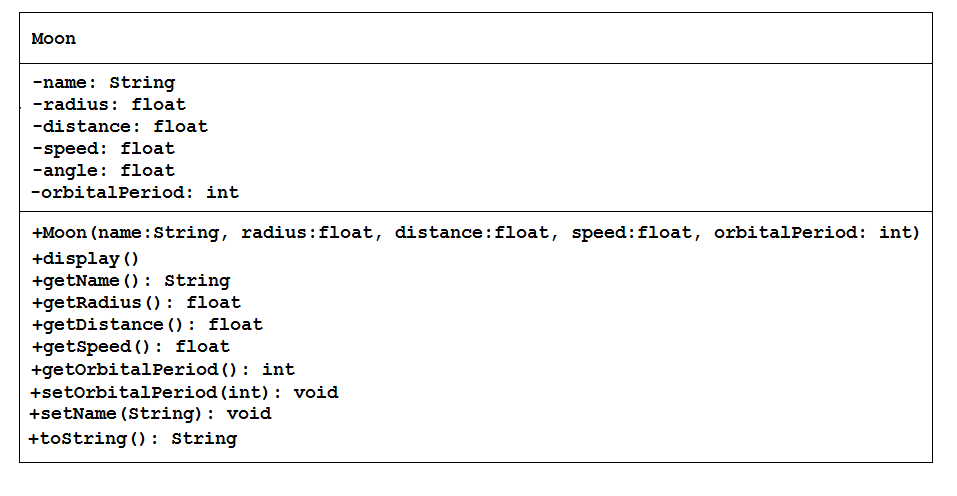
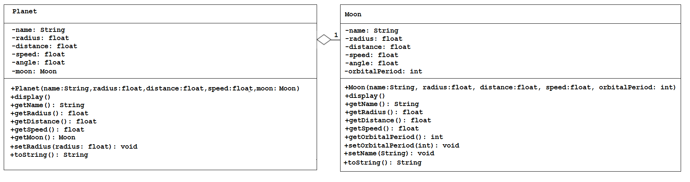
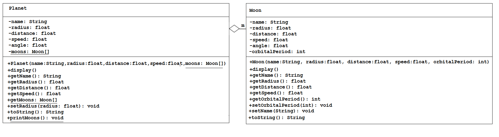
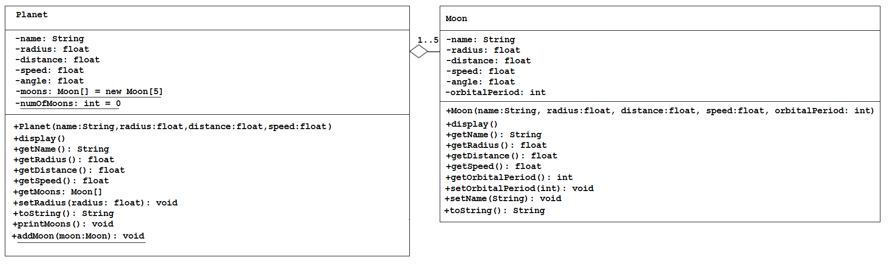

# Assignment 1

## Contents


- [Part 1](#part-1---moon-and-planet-classes)
- [Part 2](#part-2---planet-and-moon-classes---array-of-objects)
- [Part 3](#part-3)
- [Part 4](#part-4)
- [Part 5](#part-5)


Note: For each part you should have separate folders (``part1``, ``part2``, etc). 
Some of the classes you create in one part may be copied into another (and perhaps modified for the purposes of that part).


## Part 1 - Moon and Planet Classes

You should store your classes and testers in a folder called ``part1``.



A class called ``Moon`` is designed as shown in the class diagram.  It contains:

-	six private instance variables: ``name``, ``radius``, ``distance``, ``speed``, ``angle`` and ``orbitalPeriod``

-	one constructor to initialise the name, radius, distance, speed, and orbital period with the given values:

	```java
	public Moon(String name, float radius, float distance, float speed, int orbitalPeriod)

	```

	There is no default constructor for ``Moon``, as there are no defaults.

-	public getters/setters: ``getName()``, ``getRadius()``, ``getDistance()``, ``getSpeed()``, ``getOrbitalPeriod()``, ``setName()``, and ``setOrbitalPeriod()``. There are no setters for radius, distance, speed, and angle as these attributes cannot be changed.

-	A ``toString()`` method that returns "Moon: *moon-name* (orbit=*orbitPeriod*);", e.g., "Moon: earth moon(orbit=28);".

Open the test program ``TestMoon`` from the ``part1`` folder and write the code for the ``Moon`` class. Use the test program to test the constructor and public methods. Among other things, try changing the name of a moon, e.g.:

```java
moon = new Moon("Moon", 20, 100, 2, 28);
println(moon); // calls toString()
moon.setName("Earth Moon");
println(moon);

```

If your code is completed correctly, you should see a moon orbit the middle of the window.



A class called ``Planet`` is designed as shown in the class diagram. 
It contains:

-	six private instance variables: ``name``, ``radius``, ``distance``, ``speed``, ``angle`` and ``moon``.  ``moon`` is an object of the class ``Moon`` you have already created.  Assume each planet has one moon.

-	a constructor:

	```java
		public Planet(String name, float radius, float distance, float speed, Moon moon) {...}

	```

-	public methods - ``getName()``, ``getRadius()``, ``getDistance()``, ``getSpeed()``, ``getMoon()``, setRadius()``. There are no setters for name, distance, speed, angle, and moon as these attributes cannot be changed.

-	``toString()`` returns "Planet: *planet name* (r=*radius*;d=*distance*); Moon: *moon-name* (orbit=*orbitPeriod*);" e.g. "Planet: earth (r=25;d=200); Moon: Moon (orbit=28);"

Open the test program ``TestPlanet`` from the ``part1`` folder.  Add the code for your ``Moon`` class from earlier.  And write the code for the ``Planet`` class which uses the ``Moon`` class. Use the test program to test the constructor and public methods. 

Take note that you have to construct an instance of ``Moon`` before you can construct an instance of Planet. e.g.,

```java
Moon moon = new Moon("moon", 7.5, 50, 2, 28);
Planet earth = new Planet("earth", 25, 200, 1, moon);

// OR using an anonymouse Moon object

Planet earth = new Planet("earth", 25, 200, 1, new Moon("moon", 7.5, 50, 2, 28));

```

Note that both classes have similar class variables called name, radius, distance, speed and angle. However, they can be differentiated via the referencing instance. 

If your code is completed correctly, you should see a planet with a moon orbit the sun in the middle of the window.

Try:

1.	Printing the name and orbitalPeriod of the moon from a Planet instance.
(Hint: ``aPlanet.getMoon().getName()``, ``aPlanet.getMoon().getOrbitalPeriod()``).

2.	Introduce new methods (and test, of course) called ``getMoonName()`` and ``getMoonRadius()`` in the ``Planet`` class to return the name and radius of the moon of the Planet. For example,

	```java
	public String getMoonName() { ... }
	public float getMoonRadius() { ... }

	```


## Part 2 - Planet and Moon Classes - Array of Objects

Open the test program ``TestPlanetMoons`` from the ``part2`` folder.



In the previous part the assumption was that a planet has one and only one moon. 
In reality, a planet can have none, one or more moons. 
Modify the ``Planet`` class to support more than one moon by changing the instance variable ``moon`` to a ``moons`` array:

```java
-moons: Moons[]

```

Reuse the ``Moon`` class written earlier.

Notes:
-	the constructor takes an array of ``Moon`` (i.e. ``Moon[]``), instead of a ``Moon`` instance.

-	the ``toString()`` method shall return "Planet: *planet name* (r=*radius*;d=*distance*) has *n* moon(s);".  Where *n* is the number of moons.  e.g. e.g. "Planet: earth (r=100;d=100) has 1 moon(s);"

-	a new method ``printMoons()`` to print the names of all the moons.

Open the test program ``TestPlanetMoons``.

You are required to:
1.	Modify the ``Planet`` class code for the array of moons.

2.	Modify the ``getMoons()`` method to return the ``moons`` array

3.	Modify ``getMoonName()`` and ``getMoonRadius()`` so they are given an array index value of the moon whose name or radius is required.

4.	Make sure that you test the ``getMoons()`` method.

5.	The method ``printMoons()`` should print not return the planet's moons.

6.	Use this updated code for the ``Planet`` method ``display()``:

	```java
	public void display()
	{
		angle=angle+(0.01*speed);
		pushMatrix();
		rotate(angle);
		translate(distance,0);
		fill(255, 255, 255);
		ellipse(0, 0, radius*2, radius*2);    

		for(Moon moon: getMoons())
			moon.display();

		popMatrix();    
	}

	```

Test your methods. Hints:

```java
// Declare and allocate an array of Moons
Moon[] moons = new Moon[2];
moons[0] = new Moon("Phobos", 5, 50, 2, 28);
moons[1] = new Moon("Deimos", 2.5, -35, 1.5, 42);

// Declare and allocate a Planet instance
mars = new Planet("Mars", 20, 300, 1.5, moons);

print("First moon of mars is:");
println(mars.getMoonName(0));

println(mars); // toString()

print("The moons are: ");
mars.printMoons();  

```

Should print:

```
First moon of mars is:Phobos
Planet: Mars (r=20.0;d=300.0) has 2 moon(s);
The moons are: Moon: Phobos(orbit=28); Moon: Deimos(orbit=42);

```

If your code is completed correctly, you should see a planet with two moons orbit the sun in the middle of the window.


## Part 3 - Planet and Moon Classes - Fixed Length Array of Objects

Open the test program ``TestPlanetMoons`` from the ``part3`` folder.




In Part 2, the number of moons cannot be changed once a ``Planet`` instance is constructed. Suppose that we wish to allow the user to add more moons (which is not as unusual as you think, new moons were discovered in our Solar System in 2007!).

We shall remove the moons from the constructors, and add a new method called ``addMoon()`` to add the given ``Moon`` instance to this ``Planet``.
We also need to pre-allocate a ``Moon`` array, with a fixed length 5 (a planet may have 0 to 5 moons), and use another instance variable ``numMoons`` to keep track of the actual number of moons.


You are required to:

1.	Modify your ``Planet`` class to support this new requirement. 

	Hints:

	```java
	public class Planet
	{
		// private instance variable
		private Moon[] moons = new Moon[5]; // declare and allocate the array
		private int numMoons = 0;

		...
		...

		public void addMoon(Moon Moon) 
		{
			moons[numMoons] = moon;
			++numMoons;
		}
	}


2.	Use this updated code for the ``Planet`` method ``display()``. 
	Notice how it checks for ``null`` moons!

	```java
	public void display()
	{
		angle=angle+(0.01*speed);
		pushMatrix();
		rotate(angle);
		translate(distance,0);
		fill(255, 255, 255);
		ellipse(0, 0, radius*2, radius*2);    

		for(Moon moon: getMoons())
			if(moon!=null)
				moon.display();

		popMatrix();    
	}

	```

3.	Test the code.  Make sure it is accurate!

	```java	
	// create a planet object
	mars = new Planet("Mars", 20, 300, 1.5);

	println("-- BEFORE MOONS --");
	println(mars);  // toString()
	print("The Moons are: ");
	mars.printMoons();

	// add 2 moons
	mars.addMoon(new Moon("Phobos", 5, 50, 2, 28));
	mars.addMoon(new Moon("Deimos", 2.5, -35, 1.5, 42));

	println("\n-- AFTER MOONS --");
	println(mars);  // toString()
	print("The Moons are: ");
	mars.printMoons();

	```


2.	Write a ``Planet`` method called ``removeMoonByName(moonName)``, that removes the moon from this ``Planet`` instance if ``moonName`` is present. The method shall return true if it succeeds. As always, test your code.

	```java
	boolean removeMoonByName(String moonName)

	```

	Make sure that your code closes any "gaps" in the array.  For example, if your moon array contains 4 moons and you remove the second one then you should ensure that moons 3 and 4 are moved down in the array to close the gap, i.e. your ``printMoons()`` method should never print ``null`` references.  


## Part 4 - SolarSystem class 

Copy your ``Planet`` and ``Moon`` classes (as they stand at the end of Part 3) into the folder called ``part4/SolarSystemApp``. Open the ``SolarSystemApp`` project.

In most of your practical classes, you have created ``ArrayLists`` in ``setup()``.
However, in the ``SolarSystem`` class your arraylist will be encapsulated within the class. Your ``SolarSystem`` object will, in turn, contain an ``ArrayList`` object. Our initial ``SolarSystem`` will consist of:


```java
public class SolarSystem
{
	private ArrayList<Planet> planets;

	// NB: Our reference (planets) doesn’t refer to anything
	// when it was declared so our default constructor
	// makes it refer to an empty arraylist
	public SolarSystem()
	{
		planets = new ArrayList<Planet>();
	}

	// Add a Planet object to our array list
	public void addPlanet(Planet planetToAdd)
	{
		//TODO - it's only one line of code!

	}

	// Add a Planet object to our array list
	public ArrayList<Planet> getPlanets()
	{
		//TODO - it's the same as any other "get" method

	}
}
```

Please note that there is no requirement for inheritance here - a ``SolarSystem`` IS NOT A Planet (doesn’t adhere to the "is a" relationship.)

To get information into (and out of) our arraylist we now need to do that through ``SolarSystem`` methods like ``addPlanet()``.

Your tester class ``SolarSystemApp``  will now create a ``SolarSystem`` object, add some planets to it, and use the ``getPlanets()`` method to retrieve what is in the ``SolarSystem`` object. 

You must pass ``Planet`` object references into the ``addPlanet()`` method.

Assuming that you’ve implemented the ``getPlanets()`` method, calling it is straightforward. For example:

```java
void draw()
{
	...
	...
	for(Planet p: solarSystemObj.getPlanets())
	{
		p.display();
	}
}
```

You can then print the planets out. You can so this using a loop to iterate over the arraylist OR using the fact that arrayLists also override the ``toString()`` method (in fact, this calls the ``toString()`` method for each element in the ``ArrayList``).

Please note that your ``toString()`` for the ``Planet`` class must print all the moons of the planet.


Test the code with test code like:

```java
Planet earth = new Planet("earth", 25, 200, 1);
earth.addMoon(new Moon("moon", 7.5, 50, 2, 28));
ss.addPlanet(earth);

println(earth);  // toString()
print("The Moons are: ");
earth.printMoons();

```


## Part 5 - Simple Game

Now we’ll have a look at a different scenario. You are presented with 5 classes - ``Part5Game``, ``World``, ``Player``, ``Enemy`` and ``Location``.

The ``Part5Game`` class controls the game.

The ``World`` class gives us a basic world which is a grid-based arrangement that contains a ``Player`` object and an arraylist of enemies. Importantly the world provides us with methods for updating the state of our game and also drawing our world.

The ``Player`` class represents a player – it has a location (within the co-ordinates of the world). It can be moved in one of four directions.

The ``Enemy`` class represents an enemy which has a location, a number (which is used for display purposes), and a shooting range. It moves in random directions, and can catch the player if he is one cell away.

The ``Location`` class is used by the ``Enemy`` and ``Player`` classes to store and update their position.

Below is the basic grid-world with the player (Pacman) and four enemies (ghosts). The grid size is set for 6*6.


Task
----

To do.