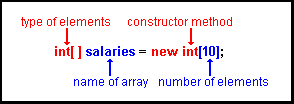
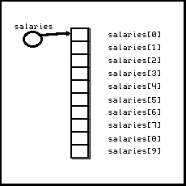
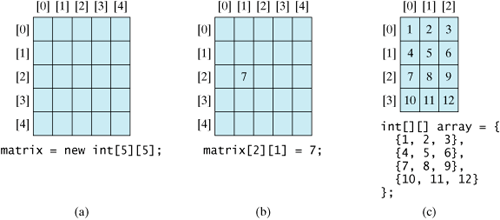

# Arrays & ArrayLists

## Contents

- [Introduction](#introduction)
- [Using Arrays](#using-arrays)
- [Arrays of objects](#arrays-of-objects)
- [Array Caveats](#array-caveats)
- [Two Dimensional Arrays](#two-dimensional-arrays)
- [ArrayLists](#arraylists)
- [Enhanced for Loop](#enhanced-for-loop)
- [```toString()``` method](#tostring-method)
- [Summary](#summary-of-array-vs-arraylist)


## Introduction 

In order to process large quantities of data you need to collect values in a data structure. Two of the most commonly used data structures in Java are *arrays* and *array lists*. 

Some things to note before we start:

-	Arrays are effectively a primitive type in Java. By that I mean that they are built into the core language and not available as a class that you import. They aren’t the same as traditional objects – i.e. you don’t get things like methods with arrays.

	

-	Array lists – and the other types available in the ``Collection`` framework – are really *managed arrays*, since they use arrays behind the scenes. This distinction is part of the ethos of objected-oriented design – arrays give us a basic mechanism to store large amounts of data; Container classes give us ways (or methods) to access, add, delete, search, and sort the data in elegant well-proven and well-tested ways.

I’d like you to refer back to this information as you become more familiar with the material

We’ll start with arrays and have a quick look at:
-	How to create arrays
-	How to access array elements (put data in and get data out)
 
We’ll concentrate primarily on so-called one-dimensional arrays. It is useful to understand two-dimensional (and even three-dimensional) arrays, but if we’re not totally at ease with 1D then there’s little point. 


## Using Arrays

The purpose of a 1D array is to enable us to represent a group of similar items (elements) as a list, with each item having a position in the list. The items in a list must all be of the same type, whether primitive/basic data type (e.g., ``int``, ``double``, ``boolean``) or reference/class type (i.e. objects). The position of each item in the list is represented by a positive integer.  

At this point and important issue to bear in mind is that an array is a contiguous block of memory locations.


### Array Declarations

Remember, before we can use any variable/object we must declare it (e.g. you can’t just go ``x = 10;`` if you haven’t specified ``int x;`` beforehand). The same holds true for arrays: we must declare the array before we use it (though, just like other variables, we can initialize the array when we declare it  e.g. ``int x = 10;``).
To store the marks of  200 students, you can declare an array, marks, of size 200 and can store the marks of as many students: 

```java
	int[] marks = new int[200];
```

As you already know, array index element number always starts with 0(zero).


#### Accessing an array

Here’s another example of an array declaration, this time with annotations:
 
Figure 1: Array declaration
This statement declares a variable called salaries. It is of type ``int[]`` (i.e., array of int). The use of the word new introduces a constructor for the array. The number in brackets after the type of the array shows how many elements are in it. The variable salaries contains a reference  to an area of memory containing a group of elements of type int. This is shown below: 



This statement declares a variable called ``salaries``. It is of type ``int[]`` (i.e., array of int). The use of the word ``new`` introduces a constructor for the array. The number in brackets after the type of the array shows how many elements are in it. The variable salaries contains a *reference*  to an area of memory containing a group of elements of type int. This is shown below: 



It is vital that you understand that an object name is actually a reference to the memory where the object resides. I will re-iterate this concept a number of times in the module because it is fundamental.

The list begins with position 0 and ends with the position numbered one less than the size of the array. 

When we access an item of the array, we treat it just as we would treat any single variable, but we use an index to specify which item in the array we want to access. For example, the code:

```java
	salaries[2]=26000;
```

will set the third element in the array salaries to the value 26000. 
And if we wanted to print out the value stored in the last element we would use

```java
	System.out.print("Salary is " + salaries[9]);

```

##### length instance field

Actually, we probably wouldn’t use ``salaries[9]`` to print the last element – we’d probably use ``salaries[salaries.length – 1]`` instead.

Even though arrays have no methods they do have one instance field, called ``length``, which returns the number of elements that the array can hold.


### Initalising Arrays

What do you think the following array is going to be used to store?

```java
	String[] monthsOfYear = new String[12];

```

Ok now I’ve got my array, and I want to put the information in, so let’s start to do that:-

```java
	monthsOfYear[0] = "January";
	monthsOfYear[1] = "February";

```

etc. A bit tedious! 

This is a situation where I know when I declare my array exactly what I want to put in it (and it’s not a massive amount of data). 

Luckily, there’s a quicker way to do this – I can intialise my array when I declare it; Like this:

```java
	//Declaring and initialising in one go
	String[] monthsOfYear = {"January", "February", "March", "April", "May"};  

```

OK, I got fed up typing but you get the idea. You don’t tell the compiler the size of the array this time because it’s obvious (big enough to hold five ``String`` references).

Ok, that’s the basics of arrays – we know how to create them, how to put information in, how to get information out, and how to initialise them (if we need to do this). 


## Arrays of objects

What if we want to store arrays of objects, rather than simple (primitive) data types like integers. 

Sounds like it will be a lot harder? NO! It’s the exact same thing (in fact, the monthsOfYear example above is an array of ``String`` objects).
The only potential little problem – from your point-of-view – is that you understand how to work with objects.


### ```Person``` class

I’ll start off my creating a simple class (which we obviously need if we want to create and use objects). I’ll start with a bare-bones class to represent Person objects.

```java
// This is a very basic class to represent a person
// We could (and will) add lots more
public class Person
{
   //instance fields (should always be private)
   private String firstName;
   private String lastName;
   private int age;
   
   //constructor (Note: no default constructor)
   public Person(String f, String l, int a)
   {
      firstName = f;
      lastName = l;
      age = a;
   }
   
   //accessor methods
   public String getFirstName()
   {
      return firstName;
   }
   
   public String getLastName()
   {
      return lastName;
   }
   
   public int getAge()
  {
      return age;
   }
}

```

Ok, so this gives me the ability to create objects of type ``Person``. It has three instance fields to define its state, and just some accessor methods to access the state of an object. If there are loads of people to keep track of in my application then storing them in an array seems to be a good idea.

Here’s an example of an application (not really; it’s just some test code to let me play about with my objects,  but it could just as easily be some database implementation):

```java
	public class ArrayOfPersonTester
	{
	   public static void main(String args[])
	   {
	      Person[] peopleDetails = new Person[2];      

 7:	      peopleDetails[0] = new Person("Jim", "Jones", 21);


10:	      System.out.println(peopleDetails[0].getFirstName());       
	   }
	}

```

Note how I declare/create the array – same as before except the type is now my own class.

On line 7 I put something into the first element – a person object. It’s vital to note that before this the array was empty. As an experiment, you should comment out line 7 and see the hassle that this causes. I’ll explain more about this in the lecture via a diagram.

On line 10 I get something out of the array – It looks a bit odd at first viewing, but you need to break it up in your head: ``peopleDetails[0]`` returns a (reference to a) ``Person`` object. Once I have an object I normally communicate with it by invoking its methods – i.e. ``objectReference.methodName()``  and that’s exactly the same thing here – I invoke the ``getFirstName()`` method for the object stored in the first element of the array.


## Array Caveats

### Don’t go out-of-bounds!

In the code above, we created an array capable of holding 2 person objects. If I change line 10 to:

```java
	System.out.println(peopleDetails[2].getFirstName());
```

I get something like this when I try to run it:

```java
	Exception in thread "main" java.lang.ArrayIndexOutOfBoundsException: 2 at ArrayOfPersonTester.main(ArrayOfPersonTester.java:10)
```

Which basically means that I’ve tried to access an array element that doesn’t exist (valid indices are 0 and 1).


### Make sure that an array element contains something

Again, going back to previous code, you might imagine that the following is fine:

```java
	System.out.println(peopleDetails[1].getFirstName());
```

But now I get:

```java
	Exception in thread "main" java.lang.NullPointerException at ArrayOfPersonTester.main(ArrayOfPersonTester.java:10)

```

What does this mean?

Well, if you refer back to the code, you’ll see that I actually made the first array element refer  to a ```Person```:

```java
       peopleDetails[0] = new Person("Jim", "Jones", 21);

```

But the second element refers to nothing (it has a ``null`` reference), so when I try to actually do something with the object referred to in the array (i.e. get the first name of the person), of course it’s going to crash at run-time because there is no person.

NOTE: you can always check an array element before you use it,  e.g.

```java
	if (peopleDetails[1] != null)
	{
		System.out.println(peopleDetails[1].getFirstName());
	}

```

You only need to do this if you’re not sure, of course.


### Arrays of primitives are different to arrays of objects

Arrays of objects contains references to objects (or null references). Arrays of primitives contains values. I’ll illustrate the difference in class.


### I always create the array when I declare my array variable

It is perfectly legal to do something like this:

```java
	int marks[]; //declare an array reference
	marks = new int[200]; //create space for the array and reference it

```

However, it is generally a better idea (as a beginner) to combine both statements into a single one.
The reason? Sometimes you’ll forget the second statement and then you’ll have an array reference that references nothing (null) and of course, it will crash when you try to do something with the (non-existant) array.


## Two dimensional arrays

Thus far, you have used one-dimensional arrays to model linear collections of elements. You can use a two-dimensional array to represent a matrix or a table.

I’m not going to spend too long on this so I’ll launch straight into an example.

You can create a two-dimensional array of 5 by 5 ``int`` values and assign it to a reference called matrix using this syntax:

```java
	int[][] matrix = new int[5][5];
```

Two subscripts are used in a two-dimensional array, one for the row, and the other for the column. As in a one-dimensional array, the index for each subscript is of the ``int`` type and starts from 0, as shown here:


 
The index of each subscript of a two-dimensional array is an ``int`` value starting from 0.

Parts (b) and (c) show assignment to an array element and initialisation of the 2D array.


## ArrayLists

Just like arrays, the ```ArrayList``` class (```java.util.ArrayList```) lets you store objects of the same type. However, Array lists offer two significant conveniences:
-	Array lists can grow and shrink as needed – with arrays we often ‘guess’ the storage needed. Not a massive problem if we guess too big, but serious problems if we guess too small.
-	The Arraylist class supplies methods for many common tasks such as inserting and removing elements.

So why would anyone use arrays when they can use something that is “better”?
Well, arrays are faster, have less overhead, offer more control, and are probably simpler to work with for small sets of data.

Arraylists are a type of managed array, which means that the class takes care of a lot of details and therefore you don’t have to worry about them, so they’re much better from that point-of-view. This contrast with arrays – I mentioned above they offer more control to the programmer but, in the words of Peter Parker’s Granny/Granda “with great power comes great responsibility”.

One final point to mention at this stage: arrays can be used to store objects or primitive data types; array lists can only store objects.


### Using ArrayLists

Let’s dive right in with a little example that utilises our ``Person`` class once again.

```java
import java.util.ArrayList; //could also use java.util.*;

public class ArrayListOfPersonTester
{
   public static void main(String args[])
   {
      ArrayList<Person> peopleDetails = new ArrayList<Person>();
      
      peopleDetails.add(new Person("Jim", "Jones", 21));

      System.out.println(peopleDetails.get(0));
      
   }
}

```

This is the same code as used in array example but using an arraylist instead now. 

The main points to note about the code above are:

1. Look at how we declare our array:  

	```java
	ArrayList<Person> peopleDetails = new ArrayList<Person>();

	```

	On the left we tell the compiler the type – i.e. an ``ArrayList`` to store Person objects, then followed by the name of our arraylist reference. 

	On the right we create the arraylist.

	If you’ve dealt with arrays for a while, the syntax may be a bit off-putting at first, but after you’ve created a few arraylists it will be second-nature. I’ll explain it in more detail in class.

	One thing to note – we don’t specify the size (although there is a constructor to do this if we want) – we start off with an empty list. With arrays we always had to specify the size.

	

2.  Once we’ve created our arraylist we need to be able to put "things" 
	(Person objects in this example) into it and get "things" out of it.

	Instead of using the square bracket notation (like we did with arrays), we use the methods provided by the ArrayList class. The most common ones used are ``add`` and ``get``. It is important that you can work with these methods (at the very least) and we’ll talk more about them in our labs.


### ArrayList Example

I don’t want to spend much time going through each method in detail. Instead, I’ve presented an example below – see if you can anticipate the output (before looking at it – cover it up with your hand or a piece of paper!). Try to follow it by drawing the array on paper – it’s the best way to learn memory/reference based concepts.

```java
	import java.util.ArrayList;

	public class AraryListDemo {

	  public static void main(String[] args) {

	    ArrayList al = new ArrayList();
	    System.out.print("Initial size of al :  " + al.size());
	    System.out.print("\n");

	    //add.elements to the array list
	    al.add("C");
	    al.add("A");
	    al.add("E");
	    al.add("B");
	    al.add("D");
	    al.add("F");
	    al.add(1,"A2");//inserts objects "A2" into array at index 1

	    System.out.print("size of al after additions " + al.size());
	    System.out.print("\n");

	    //display the array list
	    System.out.print("contents of al: " +  al );
	    System.out.print("\n");

	    //Remove elements from the array list
	    al.remove("F");
	    al.remove(2);

	    System.out.print("size of after deletions : " + al.size());
	    System.out.print("\n");
	    System.out.print("contents of al:" + al);
	    
	  }
	} 
```

Output:-

```text
	Initial size of al:  0
	size of al after additions 7
	contents of al: [C, A2, A, E, B, D, F]
	size of after deletions : 5
	contents of al:[C, A2, E, B, D]

```


### ArrayLists and wrapper classes

ArrayList stores only object references. That's why, it's impossible to use primitive data types like double or int. We use so-called wrapper classes (like ``Integer`` or ``Double``).

Java offers a convenient way to incorporate, or wrap, a primitive data type into an object (e.g., wrapping int into the ``Integer`` class, and wrapping double into the ``Double`` class). The corresponding class is called a *wrapper* class. By using a wrapper object instead of a primitive data type variable, you can take advantage of generic programming.
Java provides ``Boolean``, ``Character``, ``Double``, ``Float``, ``Byte``, ``Short``, ``Integer``, and ``Long`` wrapper classes for primitive data types. These classes are grouped in the ``java.lang`` package. 

Traditionally, you would create a wrapper object like this:

```java
	Double d = new Double(5.0);
```

OR

```java
	doubleArray.add(new Double(5.0);
```

But with newer versions of Java, the conversion between primitive types and the corresponding wrapper class is now automatic. It is called **auto-boxing** and works in both directions (boxing or un-boxing).

Note: there is substantial overhead to using wrapper classes, so it is generally fine for small amounts of data, but arrays would be used for larger amounts (or anywhere that performance is a key requirement).

If I rewrite the two statements above to take advantage of auto-boxing, I get:

```java
	Double d = 5.0;
	doubleArray.add(5.0);
```

### Collections Framework

ArrayLists are designed to work with the ``Collections`` framework, which provides static methods for searching, swapping, sorting etc.

We’ll have a look at some of these later in the module.

 
## Enhanced for Loop

A useful addition to Java 5 was the enhanced for loop. Let see how it works! 
In the enhanced for loop, the array index is not necessary for the retrieval of an array element. Below is a traditional for loop:

```java
	int data[5] = {2,4,8,16,32};

	for (int i=0; i<5; i++)
	{
	   int a = data[i]; //retrieve the element via the index
	   System.out.println("Output: " + a);
	}

```

With the enhanced for loop we can retrieve array elements without having to specify the index: 

```java 
	int data[5] = {2,4,8,16,32};

	for(int a:data)    //  check syntax, it's colon not semi-colon 
	{
	   System.out.println("Output: "+ a);
	}

```

At the beginning of each loop iteration, the next element is assigned to the variable ‘a’. Then the loop body is executed.  You should read this loop as "for each a in data".

Note: you can do the same thing with array lists. One thing to note though, is that the array index is no longer available to us, and sometimes we might want it – if so, use the traditional for loop.


## ```toString()``` method

This is actually specific to arrays and array lists but I want to mention it as soon as possible.

Referring back to our example in earlier:

```java
	import java.util.ArrayList; //could also use java.util.*;
	public class ArrayListOfPersonTester
	{
	   public static void main(String args[])
	   {
	      ArrayList<Person> peopleDetails = new ArrayList<Person>();
	      
	      peopleDetails.add(new Person("Jim", "Jones", 21));

	      System.out.println(peopleDetails.get(0).getFirstName());
	      
	   }
	}

```

This is fine if I just want to print out the person’s first name, but what if I want to print out all his details?

Basically, every class has a ``toString()`` method. You may say "Mine hasn’t because I never put it in", but it is actually there (through a concept called inheritance which we’ll discuss soon).

In fact if you try to pass an object to ``System.out.print`` it will automatically invoke the ``toString()`` method for that object. E.g.

```java
	Person p1 = new Person("Jim", "Jones", 21);      
	System.out.println(p1); // same as System.out.println(p1.toString());

```
 
And if you run it you get something like this as output:

```java
	Person@19821f

```

What does that mean? Well, that’s the default behaviour of the ``toString()`` method – it prints out the class name followed by a thing called the hash-code. 

Not a lot of use to us! BUT, we can over-ride the default behaviour and provide our own to do whatever we wish: - 

```java
   public String toString()
   {
      return firstName + " " + lastName + " " + age;
   }

```


And now our output would be:

```java
	Jim Jones 21
```

Notice the declaration/signature (i.e. the first line) of our method – it basically tells us that it doesn’t take any parameters and it will return a ``String`` to the caller – if we override the ``toString`` method for any class then the declaration will ALWAYS be the same (why? It’s to do with inheritance, which is another day’s work).

ALSO – don’t be tempted to do a ``System.out.print`` inside the method body/code – you simply return the information.


## Summary of Array Vs ArrayList

1.  We declare arrays like this (example creates an array of 10 ints) : 
	
	```java
		int[] myArray1 = new int[10];

	```

	(example creates array of 5 BankAccount objects):

	```java
		BankAccount[] myArray2 = new BankAccount[5];

	```

2.	We declare ArrayLists like this (example creates ArrayList of BankAccounts)

	```java
		ArrayList<BankAccount> myArrayList= new ArrayList<BankAccount>();

	```

3.	Arrays are fixed size (set when you declare them); ArrayLists can grow and shrink (initially they are empty – size of 0 – when you declare them).

	

4.	Arrays can be used to store primitive data types or objects; ArrayLists can only store objects – if you want to store primitives in an ArrayList you have to use the associated wrapper objects (``Integer`` instead of ``int``; ``Double`` instead of ``double``; etc)

5.	Arrays use the ``[]`` operators to index the array (both for reading and setting data). E.g. the following will set the 3rd element to 6:

	```java
		myArray1[2] = 6;

	```

	Note that arrays have no methods – the only extra little piece of data you get with arrays is a ``length`` variable that stores the length of the array – e.g. the following will print out '5':

	```java
		System.out.println(myArray2.length);

	```

6.	ArrayLists are objects – in fact they are container objects – an object which contains other objects (like BankAccount objects). 

	We don’t use [] to access them. Instead we use methods, the most common of which are:- ``add()``, ``get()``, ``size()``, ``set()`` and ``remove()``.


7.	You can initialise an array when you declare it, but you cannot do this with an ArrayList. e.g. the following will create an array of length 5 and assign it the values 6, 3, 47, 23, 1

	```java
		int[] myArray3 = {6, 3, 47, 23, 1};

	```


---
[OOP](https://github.com/barcaxi/oop)
