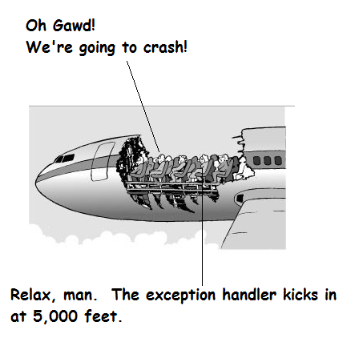

# Java Exceptions & Exception Handling

## Contents

- [Purpose of Exceptions](#purpose-of-exceptions)
- [Exception Handling](#exception-handling)
- [Another Example](#another-example)

## Purpose of Exceptions

**Exceptions** in Java are any abnormal, unexpected events or extraordinary conditions that may occur at runtime. They could be "unable to open a file", "array index out of bounds", "division by zero", and so on. When they occur Java *throws* an exception object. Java exceptions are basically Java objects. 

Below is an example without any exception handling - i.e. an exception will be thrown by Java when we attempt to do a divide-by-0 but we have no code to handle that exception.


```java
void setup()
{
  div(100, 4);     // Line 1
  div(100, 0);     // Line 2
  println("End of program");   
}

void draw()
{
}

void div(int x, int y)
{
  println("Computing Division.");
  int ans = x/y;
  println(x+" / "+y+" = "+ ans);
}
```

And here's the output when we run the program:

```
** ArithmeticException: / by zero **

Computing Division.
100 / 4 = 25
Computing Division.

```

An ``ArithmeticException`` is thrown at runtime because integer division by 0 is an illegal operation. The "End of program" message is never reached in ``setup()`` method.

OK, now that we've seen an exception, let's have a look at handling exceptions


##	Exception Handling

Java exception handling is used to handle error conditions in a program by taking some action when an exception occurs.

Actually, the exception is *thrown* by the code that encountered the exception.

In many cases it will be the classes that come with Java that throw these exceptions but we can also throw exceptions from our own classes. 

Exception handlers can be written to catch a specific exception such as ``ArithmeticException``, or an entire group of exceptions by using generic exception such as ``RuntimeException``.  More on this later.

Any exceptions not specifically handled within a Java program are caught by the Java run time environment - this is what happened in the previous example.


###	How do we handle an exception?



Use two new keywords ``try`` and ``catch``. 

The ``try`` statement says:

> try these statements, and see if you get an exception

The ``try`` statement must be followed by at least one ``catch``.

The ``catch`` says:

> I will handle any exception that matches my argument.

Matching an argument means that the thrown exception could legally be assigned to the argument exception.

Here's a solution to our previous program code:

```java
void setup()
{
  div(100, 4);     // Line 1
  div(100, 0);     // Line 2
  println("End of program");  
  exit();
}

void draw()
{
}

void div(int x, int y)
{
  println("Computing Division.");
  try
  {
    int ans = x/y;
    println(x+" / "+y+" = "+ ans);
  }
  catch(ArithmeticException e)
  {
    println("Exception : "+ e.getMessage());
  }  
}

```

And here's the new output:

```
Computing Division.
Average : 25
Computing Division.
Exception : / by zero
End of program

```
 
Let's look at the output:

We're no longer getting a run-time error.  That's because we're now catching (handling) the exception - rather than the Java run-time environment.  The ``catch```block is passed a object ``e`` with information about the exception.

The ``getMessage()`` method returns a detail message about the problem.

Also, the code is now getting a chance to finish (i.e. print out "End of program"). Again, this is because we've caught the exception and the assumption is made that the program can continue.


### In Summary

-	Some code may decide to throw an exception object when it encounters a run-time problem.

-	Up until now, we've left it to the Java run-time environment to handle the exception (which will be by exiting the program and printing information about the problem).

-	Now, we're aware that we can handle the exception, if we choose.

-	Handling the exception is not just a matter of catching it. We must also supply a try block around the code that could throw the exception - i.e. try and catch go hand-in-hand.


 
## Another Example

Here's an example of code that tries to access an array position that doesn't exist.  Notice how ``+1`` is added to the ``length`` attribute.  This will cause a run-time error.  But we write a ``try catch`` statement to catch and handle it.


```java
int[] lottonumbers = {11, 22, 31, 34, 35, 46};

void setup()
{
  //size(800,800);  
  for (int i=0; i<lottonumbers.length+1; i++)
  {
    try
    {
      println(lottonumbers[i]);
    }
    catch(ArrayIndexOutOfBoundsException e)
    {
      println(i+ ": no such array index position");
    }
  }
}

void draw()
{
}

```


It will print:

```
11
22
31
34
35
46
6: no such array index position

```

This is an introduction. It is enough to get us started with the concept of exception handling. We will revist this topic later.

## Exception Propagation

In the previous program where a division by zero runtime error occured the exception was handled within the ``div()`` method like this:

```java
...
...

void div(int x, int y)
{
  println("Computing Division.");
  try
  {
    int ans = x/y;
    println(x+" / "+y+" = "+ ans);
  }
  catch(ArithmeticException e)
  {
    println("Exception : "+ e.getMessage());
  }  
}

```

If the exception is not handled in ``div()`` where it occurs the exception is sent up the call chain to the statement where the method ``div()`` was called.  Java will look for a ``try catch`` statement enclosing the method call.  

So, we could have caught the exception with code like this:

```java
void setup()
{
  try
  {
    div(100, 4);     // Line 1
    div(100, 0);     // Line 2
  }
  catch(ArithmeticException e)
  {
    println("Exception : "+ e.getMessage());
  }

  println("End of program");  
  exit();
}

void draw()
{
}

void div(int x, int y)
{
  println("Computing Division.");
  int ans = x/y;
  println(x+" / "+y+" = "+ ans);
}

```


## User-Defined Exceptions

To do.
