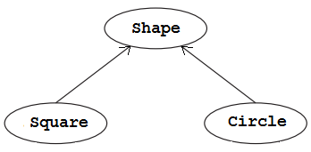

# Inheritance

## Contents

- [Inheritance](#inheritance)
- [An Example of Inheritance]
- [Access Modifiers]
- [Method overriding]


##  Introduction

To see what inheritance means in practice, consider the example of the taxonomy of the animal kingdom.  In biology, animals are classified by whether they have a spinal cord (vertebrae) or not.  All *mammals* have a spinal cord.  They inherit it as a characteristic because they are a subclass of *vertebrates*.  


In Java inheritance occurs when a class adopts or adapts the data structures and methods of a parent class.  That creates a hierarchy, similar to taxonomies in the animal kingdom.  Each level is a specialisation of the one above in the hierarchy.  

Inheritance is one of the key concepts people mean when they talk about Object-Oriented Programming.

Let's take a look at the world of animals: dogs, cats, monkeys, pandas, wombats, etc. 

Let's begin by programming a ``Dog`` class.  It will have an ``age`` variable and methods such as ``eat()``, ``sleep()``, and ``bark()``.

```java
public class Dog 
{
  private int age;

  public Dog() 
  {
    age = 0;
  }
  
  public void eat() 
  {
    // eating code goes here
  }
  
  public void sleep() 
  {
    // sleeping code goes here
  }
  
  public void bark() 
  {
    println("woof!");
  }
} 

```

Let's program the ``Cat`` class:

```java
public class Cat 
{
  private int age;

  public Cat() 
  {
    age = 0;
  }
  
  public void eat() 
  {
    // eating code goes here
  }
  
  public void sleep() 
  {
    // sleeping code goes here
  }
  
  public void meow() 
  {
    println("meow!");
  }
} 

```

Notice how dogs and cats have the same variable ``age`` and methods ``eat()`` and ``sleep()``.  They have unique methods for barking or meowing though.


What if we could develop a generic ``Animal`` class to describe any type of animal? After all, all animals have an age, eat, and sleep. We could then say the following:

- A dog **is-a** animal and has all the properties of animals and can do all the things animals can do. In addition, a dog can bark.

- A cat **is-a** animal and has all the properties of animals and can do all the things animals can do. In addition, a cat can meow. 

The relationship described is known as a **is-a** relationship.

> A ``Dog`` **is-a** ``Animal`` and a ``Cat`` **is-a** ``Animal``


*Inheritance* allows us to program just this. With inheritance, classes can inherit  properties (variables) and functionality (methods) from other classes. The ``Dog`` class is a child (AKA a *subclass*) of the ``Animal`` class.  Children inherit all variables and functions automatically from their parent (AKA *superclass*). Children can also include additional variables and functions not found in the parent. Inheritance follows a treestructure (much like a taxonomy of the animal kingdom). Dogs can inherit from Canines which inherit from Mammals which inherit from vertabrates, and so on. 


Here is how the syntax works with inheritance. 

The ``Animal`` class is the parent (or super) class:

```java
public class Animal 
{
  private int age;

  public Animal() 
  {
    age = 0;
  }

  public void eat() 
  {
    // eating code goes here
  }

  public void sleep() 
  {
    // sleeping code goes here
  }

  // setter and getter for age
  public int setAge(int age)
  {
    this.age=age;
  }

  public int getAge()
  {
    return age;
  }

} 

```

The ``Dog`` and ``Cat`` classes are child (or sub) classes:

```java
public class Dog extends Animal
{
  public Dog() 
  {
    super();
  }
  
  public void bark() 
  {
    println("woof!");
  }
} 

```

```java
public class Cat extends Animal
{
  public Cat() 
  {
    super();
  }
  
  public void meow() 
  {
    println("meow!");
  }
} 

```

We can test this code:

```java
Dog dog = new Dog();
dog.setAge(12);
println("age="+dog.getAge());  
dog.bark();
dog.eat();

```

and it prints:

```
age=12
woof!
yummy!

```

- Notice that the methods ``setAge()``, ``getAge()`` and ``eat()`` are inherited from the parent class ``Animal``.

- Inheritance is achieved by using the keyword ``extends``, for example:

  ```java
  public class Cat extends Animal

  ```

- The ``super()`` keyword means execute the code found in the parent class constructor.  For example, ``super()`` in the ``Dog`` constructor calls the ``Animal`` class constructor ``Animal()`` first.  This is sometimes referred to as *constructor chaining*.

  ```java
    ...
    ...
    public Dog() 
    {
      super();
    }
    ...
    ...

  ```

- ``bark()`` and ``meow()`` are defined in ``Dog`` and ``Cat`` as they are a characteristic specific to that class.

A subclass can be expanded to include additional functions and properties beyond what is contained in the superclass. For example, let's assume that a ``Dog`` object has a hair color variable in addition to age:

```java
public class Dog extends Animal 
{
  private color haircolor;
  
  public Dog() 
  {
    super();
    haircolor = color(0);  // black
  }

  public void bark() 
  {
    println("woof!");
  }
} 

```

Note how the parent constructor is called via ``super()``, setting the age to 0, but the haircolor is set inside the ``Dog`` constructor itself.

Suppose a ``Dog`` object eats differently than a generic ``Animal``. Parent functions can be **overridden** by rewriting the function inside the subclass:

```java
public class Dog extends Animal 
{
  private color haircolor;
  
  public Dog() 
  {
    super();
    haircolor = color(0);  // black
  }

  public void bark() 
  {
    println("woof!");
  }

  public void eat()
  {
    // Code for how a dog specifically eats
  }

} 

```

But what if a ``Dog`` should eat the same way an ``Animal`` does, but with some additional functionality?  A subclass can both run the code from a parent class and incorporate some custom code.

```java
public class Dog extends Animal 
{
  private color haircolor;
  
  public Dog() 
  {
    super();
    haircolor = color(0);  // black
  }

  public void bark() 
  {
    println("woof!");
  }

  public void eat()
  {
    // Call eat() from Animal
    super.eat();  

    // Add code for how a dog specifically eats
    println("yummy!");
  }

} 

```

Note how the parent method ``eat()`` is called via ``super().eat()`` first and then custom code for eating is executed.


## Why Use Inheritance?

**Reusability**

Building new components by utilising existing components is an important aspect of OO paradigm.  It's always good if we are able to reuse something that is already exists rather than creating the same all over again.  This is achieved by creating new classes, reusing the properties of existing classes.

**Extensibility**

New functionality may be easily added without changing existing classes as long the new functionality extends given base classes. 


## An Example of Inheritance

Let's develop a working example of inheritance in Processing.



A typical example of inheritance involves shapes - useful because of its simplicity. We will create a generic ``Shape`` class where all ``Shape`` objects have an (x,y) location as well as a size, and a function for display. 

The code for ``Shape`` looks like this:

```java
public class Shape
{
  private int x;
  private int y;
  private int radius;

  public Shape(int x, int y, int radius)
  {
    this.x=x;
    this.y=y;
    this.radius=radius;
  }

  public void display()
  {
    point(x, y);
  }
}

```

- This generic shape doesn't know how to be displayed yet. This will be implemented in the subclasses.

Next, we create a subclass ``Square`` that extends ``Shape``. 

```java
public class Square extends Shape
{  
  public Square(int x, int y, int radius)
  {
    super(x, y, radius);
  }

  public void display()
  {    
    rectMode(CENTER); 
    rect(x, y, radius, radius);
  }
}

```


- It will inherit all the methods from ``Shape``. 

- It has a new constructor named ``Square`` that gets 3 arguments for x, y, and radius.  It executes the code in the parent class constructor by calling ``super()``.  Note how it passes the ``Square`` constructor arguments ``x``, ``y``, and ``radius`` to the parent constructor with the same number of arguments:

  ```java
  super(x, y, radius);

  ```

- Also, because we want to display the square onscreen, we override the ``display()`` method.


However, there is a compilation error that appears:


The compiler is telling use that the ``Shape`` variable ``x`` is not visible.  If you look at the code for Shape's ``x`` variable you'll see that it, ``y``, and ``radius`` were declared as a ``private``:

```java
private int x;
private int y;
private int radius;

```

This means that these variables are not visible outside the class ``Shape``.  Even because we extend ``Shape`` in ``Square`` those variables cannot be accessed outside ``Shape``.  To solve this we need to write public getter methods for ``x``, ``y`` and ``radius``.  

Never declare class variables as ``public``.  If you do then you're messing with the whole point of having classes.  The only code that should access a class variable is the class's methods.  That is the principle of *encapsulation*.

Our updated ``Shape`` class will look like this:

```java
public class Shape
{
  private int x;
  private int y;
  private int radius;

  public Shape(int x, int y, int radius)
  {
    this.x=x;
    this.y=y;
    this.radius=radius;
  }

  public void display()
  {
    point(x, y);
  }

  public int getX()  // public method accessible outside Shape
  {
    return x;
  }

  public int getY()  // public method accessible outside Shape
  {
    return y;
  }

  public int getRadius()  // public method accessible outside Shape
  {
    return radius;
  }
}

```

and the ``Square`` class ``display()`` method is updated to this:

```java
public class Square extends Shape
{  
  public Square(int x, int y, int radius)
  {
    super(x, y, radius);
  }

  public void display()
  {    
    rectMode(CENTER);
    rect(getX(), getY(), getRadius(), getRadius());  // uses public getters from Shape
  }
}

```

To demonstrate that inheritance is working, here is code to makes a ``Square``

```java
Square s;

void setup() 
{
  size(200,200);

  // A square and circle
  s = new Square(75,75,10);
}

void draw() 
{
  background(0,0,0);
  s.display();
}

```

## Method Overriding

We've already seen instances of where a child class *overrides* parent methods by rewritting the method inside the child class.  For example:

1.  the ``eat()`` method in ``Dog`` overrides the ``eat()`` method in ``Animal``
2.  the ``display()`` method in ``Square`` overrides the ``display()`` method in ``Shape``


An overridden method is simply a method in a subclass that has the exact same signature as a method in the superclass. Note that this implies it is specifically to do with inheritance.

Note, method overriding is different from method overloading.


## Is-a versus Has-a

Don't confuse inheritance with compositon, that is, having a data field that is another class.

The way to distinguish between these two concepts is to ask yourself the "is-a" versus "has-a" question.  Let's assume you have a ``Car`` class and an ``Engine`` class, and you want to decide where to use inheritance or composition.  Would you say "a car has an engine" or "a car is an engine"?  If the answer is "has-a" use composition.  If the answer is "is-a" use inheritance.

In general, inheritance is for specialisation of a class and composition is for reuse of a class.


## Access Modifiers

To do.

## Multiple inheritance

You may have heard about OOP languages having multiple inheritance.  That means having more than one immediate parent class.  The child class would have characteristics from all its immediate parent classes.

Java does not support direct multiple inheritance, but does provide a similar way of implementing it using *interfaces*.  More on *interfaces* later.


