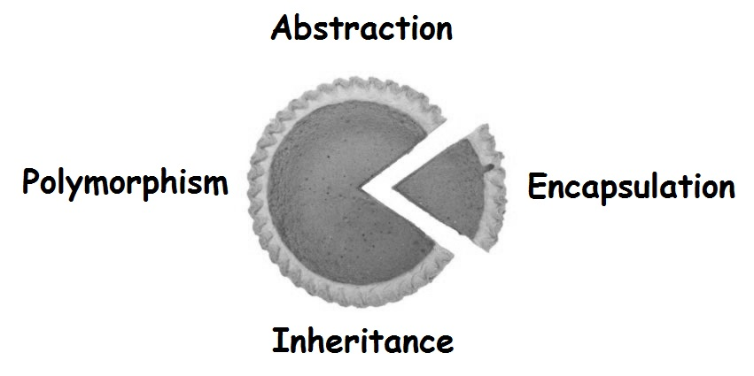
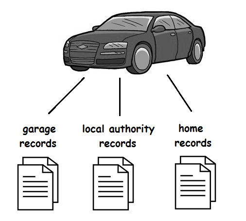

# Object-Oriented Programming

## Introduction

Java is an object-oriented programming language and to understand Java you have to understand the concepts of OOP.  Fortunately, OOP is based upon some simple ideas.

OOP is based upon a small number of common-sense fundamentals.  Unfortunately, OOP has some special terminology, and it is difficult to understand any part without first understanding most of the others parts.  But, most programmers can understand it when it is explained clearly to them.

Here, OOP is described in simple English, and related to other familiar programming features.

OOP is based upon four key principles: **abstraction**, **encapsulation**, **inheritance** and **polymorphism**.  We'll deal with the first two now and the other two later.




## Abstraction

To process something from the real world on a computer, we have to extract the essential characteristics.  The data representing these characteristics are how we will process that thing in the system.

Data abstraction is the process of refining away the unimportant details of an object, so that only the appropriate characteristics that describe it remain.

Abstraction of something depends on the viewpoint.  Take for example, a car.  A Motor Taxation Authority will need to record the unique vehicle identification number, the license plate, current owner, tax due date, etc.  A garage will need to record the license plate, work description, billing information, service history, etc.  The vehicle owner may want to record running costs, NCT due date, insurance quotes, mileage per gallon, etc.



These are all examples of data abstractions.


## Encapsulation

After abstraction is the recognition that, equally as important as data, are the operations that are performed on it.  Encapulation simply means that there should be a way to associate the two closely together and treat them as a single unit of organisation.  Data and related operations should be bundled together.  Furthermore, this single unit should prevent access to its data in inappropriate ways.  Only predetermined operations can access the data.

The collective term for data and operations bundled together with access restrictions is a **class**.


## Abstraction and Encapsulation by Example

Assume we are primarily concerned with only the nutritional value of fruit.  As a result the characteristics that we abstract out and record are *grams* and *calories per gram* - abstraction.

We also bundle together this data with an operation (method) that can calculate the total calories - encapsulation.

Our class would look like this:

```java
class Fruit
{
	private int grams;
	private int calsPerGram;

	public int totalCalories()
	{
		return grams*calsPerGram;
	}
}

```

We'll describe the access modifiers private, public, etc. in more detail later.


## Inheritance

## Polymorphism


