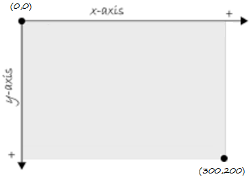
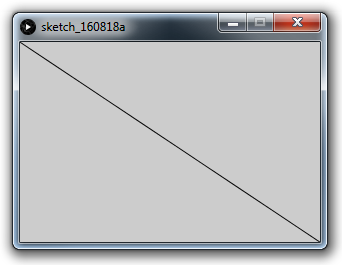
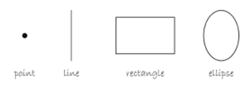
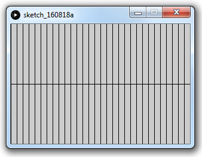
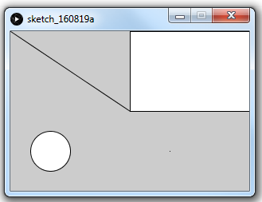
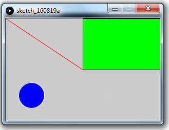

# Processing Primer

# Contents
- [Coordinate System](#coordinate-system)
- [Shapes](#shapes)
- [Stroke, Fill & Colour](#stroke-fill-colour)


# What is Processing?


# Coordinate System

The coordinate system for pixels in a computer window has a x-axis and y-axis. (0,0) is the coordinate for the top left corner.




You can specify the size of a window using the ``size()`` method.  For example:

```java
size(300,200);
line(0,0,300,200);
```


# Shapes



You can draw a number of shapes such as -- [``line()``](https://processing.org/reference/line_.html "line()"), [``rect()``](https://processing.org/reference/rect_.html "rect()"), [``ellipse()``](https://processing.org/reference/ellipse_.html "ellipse()") and [``point()``](https://processing.org/reference/point_.html "point()")

## Lines

The [``line()``](https://processing.org/reference/line_.html "line()") methods draws a line (a direct path between two points) on the screen.

```java
size(300, 200);
line(0, 100, 300, 100);  // a horizontal line across middle

// vertical lines every 10 pixels
for (int x=0; x<300; x=x+10)
  line(x, 0, x, 200);  
```



## Rectangles, Ellipses & Points

```java
size(300, 200);

line(0, 0, 150, 100);
rect(150, 0, 300, 100);
ellipse(50, 150, 50, 50);
point(200, 150);
```


# Stroke Fill Colour

In Processing, every shape has a [``stroke()``](https://processing.org/reference/stroke_.html "stroke()") and/or a [``fill()``](https://processing.org/reference/fill_.html "fill()"). 

The *stroke* specifes the color for the outline of the shape, and the *fill* specifes the color for the interior of that shape. The default colours for stroke and fill are black and white respectively.

Digital colours are constructed by mixing three primary colours -  red, green, and blue (i.e., *RGB* colour).  RGB colours are expressed as ranges from 0 (none of that colour) to 255 (as much as possible).  RGB colours are listed in the order red, green, and blue. You will get the hang of RGB color mixing through experimentation.

By adding the [``stroke()``](https://processing.org/reference/stroke_.html "stroke()") and [``fill()``](https://processing.org/reference/fill_.html "fill()") methods before the shape is drawn, you can set the color.

For example:

```java
size(300, 200);

stroke(255, 0, 0); // red
line(0, 0, 150, 100); 

stroke(0, 0, 0); // black
fill(0, 255, 0); // green  
rect(150, 0, 300, 100);

stroke(255, 255, 255);  // white
fill(0, 0, 255);  // blue
ellipse(50, 150, 50, 50);

stroke(255, 255, 0); // yellow
point(200, 150);
```



# Methods

[``size()``](https://processing.org/reference/size_.html "size()")
[``line()``](https://processing.org/reference/line_.html "line()")