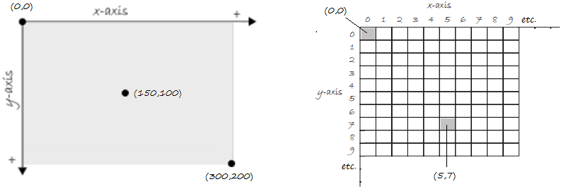

# Processing Primer


# Contents

- [What is Processing?](#what-is-processing)
- [Coordinate System](#coordinate-system)
- [Shapes](#shapes)
- [Stroke, Fill & Colour](#stroke-fill-colour)
- [Processing Reference](#processing-reference)
- [Program Flow](#program-flow)
- [Processing Built-In Variables](#processing-built-in-variables)
- [Processing Events](#processing-events)
- [Processing Built-In Methods](#processing-built-in-methods)
- [Processing Methods](#processing-methods)
- [Processing Variables](#processing-variables)


# What is Processing?

 Processing is really Java 

Processing programs are informally referred to as sketches
The folder where you store your sketches is called your sketchbook


.. http://learningprocessing.com/videos/2-0

processing.org website.  
Can download it

<show first screen>

It is a Java programming environment/tool
	with the purpose of teaching the fundamentals of computer programming in a visual context
	
it has a set of added methods that allows us to easily draw to the screen
it has examples and a community
Anatomy of buttons at top
Run = compile and execute your code

use this code:
```java
size(300,200);
line(0,0,300,200);
```
and show output and code in a image

Processing website has a Reference which has a list of all the processing methods
For example here is reference for the line() or rect() method


# Coordinate System

The coordinate system for pixels in a computer window has a x-axis and y-axis. (0,0) is the coordinate for the top left corner.




You can specify the size of a window using the ``size()`` method.  For example:

```java
size(300,200);
line(0,0,300,200);
```


# Shapes


You can draw a number of shapes such as -- [``line()``](https://processing.org/reference/line_.html "line()"), [``rect()``](https://processing.org/reference/rect_.html "rect()"), [``ellipse()``](https://processing.org/reference/ellipse_.html "ellipse()") and [``point()``](https://processing.org/reference/point_.html "point()")

## Lines

The [``line()``](https://processing.org/reference/line_.html "line()") method draws a line (a direct path between two points) on the screen.

```java
size(300, 200);
line(0, 100, 300, 100);  // a horizontal line across middle

// vertical lines every 10 pixels
for (int x=0; x<300; x=x+10)
  line(x, 0, x, 200);  
```


## Rectangles, Ellipses & Points

```java
size(300, 200);

line(0, 0, 150, 100);
rect(150, 0, 300, 100);
ellipse(50, 150, 50, 50);
point(200, 150);
```


# Stroke Fill Colour

In Processing, every shape has a [``stroke()``](https://processing.org/reference/stroke_.html "stroke()") and/or a [``fill()``](https://processing.org/reference/fill_.html "fill()"). 

The *stroke* specifes the color for the outline of the shape, and the *fill* specifes the color for the interior of that shape. The default colours for stroke and fill are black and white respectively.

Digital colours are constructed by mixing three primary colours -  red, green, and blue (i.e. *RGB* colour).  RGB colours are expressed as ranges from 0 (none of that colour) to 255 (as much as possible).  RGB colours are listed in the order red, green, and blue. You will get the hang of RGB color mixing through experimentation.

Here is a handy [Colour Picker](http://www.w3schools.com/colors/colors_picker.asp "W3 Colour Picker") or use the **Color Selector** from the ``Tools`` menu.

By adding the [``stroke()``](https://processing.org/reference/stroke_.html "stroke()") and [``fill()``](https://processing.org/reference/fill_.html "fill()") methods before the shape is drawn, you can set the color.

For example:

```java
// background(0, 0, 0);
size(300, 200);

stroke(255, 0, 0); // red
line(0, 0, 150, 100); 

stroke(0, 0, 0); // black
fill(0, 255, 0); // green  
rect(150, 0, 300, 100);

stroke(255, 255, 255);  // white
fill(0, 0, 255);  // blue
ellipse(50, 150, 50, 50);

stroke(255, 255, 0); // yellow
point(200, 150);
```
The [``background()``](https://processing.org/reference/background_.html "background()") method sets the background color of the window.  The default is light gray.


# Processing Reference

The methods we have seen like ```ellipse()```, ```line()```, etc. are all part of Processing's library. 
But how do we find out about these methods and others?
The answer is to use the [Processing Reference](https://processing.org/reference/ "Processing Reference"). 
There you can browse all of the available methods by category or alphabetically.


# Program Flow

In the programs shown so far the instructions are executed in sequence from the first instruction to the last instruction - the flow is sequential.
This sequential flow is typical of all programs you wrote in *OOP* last year.

However, in *Problem Solving with Robots* a different way of executing instructions was seen with the Robocode software.  
The flow was event driven.
Instructions were executed when an event occured.  For example, a block of code was executed when the robot scanned another robot, or a block of code was executed when the robot was hit by a bullet.  In later modules you will use this event-driven again for GUI programming.

The Processing environment typically uses 2 blocks of code to control the flow of its programs - the methods ```setup()``` and ```draw()```.

```setup()``` is used to execute certain instructions at the start of the program only **once**.

```draw()``` is used to execute certain instructions **continuously**.  

**Why use these methods?**

There are often things you need to first initialise in a program:

-	set the size of the window
-	intialise variables
-	draw content in starting locations	

Then there things you need to do as the program runs:

-	move the content
-	get user input 
-	check location of things 
-	change variable values
-	draw new content

For example, this program [ellipse_moving](https://github.com/barcaxi/oop/blob/master/code/notes/ellipseMoving/ellipseMoving.pde) draws an ellipse that moves across the screen:

```java
float x; 

// setup() runs first one time
void setup() 
{  
  size(200, 200); // Set the size of the window  
  x=0;            // intialise x coordinated
}

// draw() loops continuously until you close the window
void draw() 
{
  background(0, 0, 0);
  fill(255, 255, 255); 

  ellipse(x, 100, 50, 50);  // draw ellipse using x
  x++;                      // add 1 to x
}

```


By incrementing ``x`` we add variation to the x location of our ellipse.

These 2 blocks of code will form the template of all of our programs from now on.


# Processing Built-In Variables

Processing has some handy built-in system variables that can be used.

For example [``mouseX``](https://processing.org/reference/mouseX.html "mouseX()") and [``height``](https://processing.org/reference/height.html "height()") variables are used here in the program [ellipse_tracking](https://github.com/barcaxi/oop/tree/master/code/notes/ellipseTracking).

```java
// runs one time
void setup() 
{
  // Set the size of the window
  size(640, 360);
}

// loops continuously 
void draw() 
{
  background(0, 0, 0);
  fill(255, 255, 255); 

  ellipse(mouseX, height/2, 50, 50);  // draw ellipse using mouse x coordinate
}

```

A few other built-in variables are [``mouseY``](https://processing.org/reference/mouseY.html "mouseY()") and [``width``](https://processing.org/reference/width.html "width()").  And there are many more to find at the [Processing Reference](https://processing.org/reference/)


# Processing Events

We already talked about events and the flow of a typical Processing program in the [Program Flow](#program-flow) section.  Two useful interaction events that can occur are mouse events and key events.  For example, let's say we want to do something when a mouse click event happens or a key is pressed.  There are built-in methods called [``mousePressed()``](https://processing.org/reference/mousePressed_.html) and [``keyPressed()``](https://processing.org/reference/keyPressed_.html) which is used in the program [ellipse_mouse](https://github.com/barcaxi/oop/blob/master/code/notes/ellipseMouse/) below:

```java
void setup()
{
  size(640, 360);
  background(0, 0, 0);
}

void draw()
{
  // draw nothing here
}

void mousePressed()
{
  ellipse(mouseX, mouseY, 50, 50);  // draw a ellipse at mouse (x,y) coords
}

void keyPressed()
{
  if(key==' ')
    background(0, 0, 0);  // clear if spacebar pressed
}

```

These new methods are executed once each time the corresponding event occurs.

Using the mouse and keyboard will allow us to add some nice interaction capabilities to our programs.


# Processing Built-In Methods

There follows examples of some more useful built-in Processing methods.

- [``random()``](https://processing.org/reference/random_.html "random()")

  Generates a random number within a specified range.

  For example, the program [ellipse_random](https://github.com/barcaxi/oop/blob/master/code/notes/ellipseRandom/) draws ellipses at random (x,y) coordinates:

  ```java
  void setup()
  {
    size(640, 360);
    background(0, 0, 0);
  }

  void draw()
  {
    float x = random(width);
    float y= random(height);
    ellipse(x, y, 50, 50);
  }

  ```

- [``print()``](https://processing.org/reference/print_.html "print()") & [``println()``](https://processing.org/reference/println_.html "println()")


  These write to the console area, the black rectangle at the bottom of the Processing environment.  Similar to ``System.out.println()`` used to print to console in jGrasp.

  ```java
  println("hello, world!");  
  print("hello, ");  
  println("world!"); 

  ```

- [``text()``](https://processing.org/reference/text_.html "text()") & [``textSize()``](https://processing.org/reference/textSize_.html "textSize()")


  ``text()`` draws text to the screen at a specified (x,y) location.

  ``textSize()`` sets the font size.

  For example, the program [text_helloworld](https://github.com/barcaxi/oop/blob/master/code/notes/textHelloWorld/) draws "hello world" at the mouse (x,y) coordinates:

  ```java
  void setup()
  {
    size(640, 360);
  }

  void draw()
  {
    background(0, 0, 0);
    textSize(32);
    text("hello, word!", mouseX, mouseY);
  }

  ```


- [``loadImage()``](https://processing.org/reference/loadImage_.html "loadImage()") & [``image()``](https://processing.org/reference/image_.html "image()")


  The ``loadImage()`` method loads an image into a variable of type ``PImage``.

  The ``image()`` method draws an image to the display window.

  For example, the program [image_earthrise](https://github.com/barcaxi/oop/blob/master/code/notes/imageEarthRise/) loads and draws ``earthrise.jpg``

  ```java
  PImage img;

  void setup() {
    size(300, 300);
    
    img = loadImage("./earthrise.jpg");  // image in same directory to program
  }

  void draw() {
    image(img, 0, 0);
  }

  ```

- [``map()``](https://processing.org/reference/map_.html "map()")


# Processing Methods

[``size()``](https://processing.org/reference/size_.html "size()")
[``line()``](https://processing.org/reference/line_.html "line()")
[``rect()``](https://processing.org/reference/rect_.html "rect()")
[``ellipse()``](https://processing.org/reference/ellipse_.html "ellipse()") 
[``point()``](https://processing.org/reference/point_.html "point()")
[``stroke()``](https://processing.org/reference/stroke_.html "stroke()")
[``fill()``](https://processing.org/reference/fill_.html "fill()")
[``background()``](https://processing.org/reference/background_.html "background()")
[``setup()``](https://processing.org/reference/setup_.html "setup()")
[``draw()``](https://processing.org/reference/draw_.html "draw()")
[``mousePressed()``](https://processing.org/reference/mousePressed_.html "mousePressed()")
[``keyPressed()``](https://processing.org/reference/keyPressed_.html "keyPressed()")
[``random()``](https://processing.org/reference/random_.html "random()")
[``print()``](https://processing.org/reference/print_.html "print()") 
[``println()``](https://processing.org/reference/println_.html "println()")
[``text()``](https://processing.org/reference/text_.html "text()") 
[``textSize()``](https://processing.org/reference/textSize_.html "textSize()")
[``loadImage()``](https://processing.org/reference/loadImage_.html "loadImage()") 
[``image()``](https://processing.org/reference/image_.html "image()")
[``map()``](https://processing.org/reference/map_.html "map()")


# Processing Variables

[``mouseX``](https://processing.org/reference/mouseX.html "mouseX()")
[``mouseY``](https://processing.org/reference/mouseY.html "mouseY()")
[``width``](https://processing.org/reference/width.html "width()")
[``height``](https://processing.org/reference/height.html "height()")