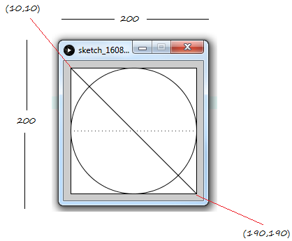
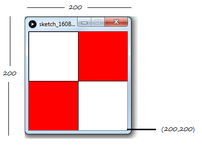
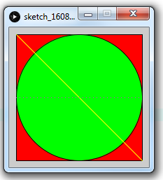

# Tutorial #1 - Processing Primer


# Contents


# Part 

1.	Using the blank graph here to draw the primitive shapes specified by the code:

	```java
	line(0,0,19,6);
	point(0,2);
	point(0,4);
	rect(5,5,10,10);
	ellipse(15,15,4,4); 
	```

2.	Given the shapes shown below provide the shape drawing instructions for it.

	

	Answer:

	```java
	size(200,200);

	rect(10,10,180,180);
	ellipse(100,100,180,180);
	line(10,10,190,190);

	for(int i=10;i<190;i=i+5)
	  point(i,100);
	 
	```

3.	Give the instructions to draw the following output

	

4.	Provide the missing RGB values for the colours needed in the code:

	

	```java
	size(200, 200);

	fill(___, ___, ___);          // red 
	rect(10, 10, 180, 180);  

	fill(___, ___, ___);          // green
	ellipse(100, 100, 180, 180);

	stroke(___, ___, ___);        // yellow line
	line(10, 10, 190, 190); 

	stroke(___, ___, ___);        // purple points
	for (int i=10; i<190; i=i+5)
	  point(i, 100);
	 
	```
	You can use a this [Colour Picker](http://www.w3schools.com/colors/colors_picker.asp "Colour Picker") 

5.	Design a *simple* creature using simple shapes and colors. 
	Draw the creature by hand using only points, lines, rectangles, and ellipses. 
	Then attempt to write the code for the creature using commands like - ```point()```, 
	```line()```, ```rect( )```, ```ellipse()```, ```stroke()``` , and ```fill( )```. 

	You will get to use this creature in later exercises.


see file:///C:/Users/tomo/Desktop/Learning_Processing_-_A_Beginners_Guide_to_Programming_Images_Animation_and_Interaction_--_Daniel_Shiffman.pdf
