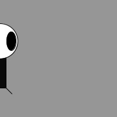
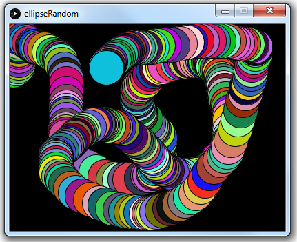
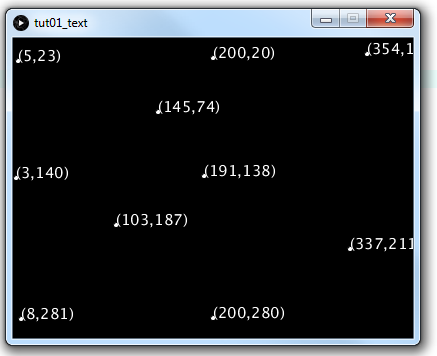

# Tutorial #1 - Processing Primer


## Part 1 - Run Processing

1.	Run the *Processing* tool by choosing:

	```
	Start> Programming> processing
	```

	You should then see the Processing environment:

	


2.	Run a sample program (aka sketch)

	Choose:

	```
	File> Examples... Basics> Color> Brightness
	```

	and press the *run* button.

	Choose any of the other example programs and run them too.


3.	Create a new sketch (aka program) called [tut01_01_shapes](https://github.com/barcaxi/oop/tree/master/code/tutorials/tut01_01_shapes) using the code below and run it:

	```java	
	size(300, 200);

	// line
	line(0, 0, 150, 100);

	// rectangle
	rect(150, 0, 300, 100);

	// ellipse
	ellipse(50, 150, 50, 50);

	// point
	point(200, 150);

	println("Some simple shapes");

	```

4.	The program above works because there are no errors in it.
	The program [tut01_02_errors](https://github.com/barcaxi/oop/tree/master/code/tutorials/tut01_02_errors) below has errors.  
	Carefully examine the error messages shown and fix them.

	```java
	size(300, 200);

	// line
	line();

	// rectangle
	rect(150, 0, 300, 100)

	// ellipse
	ellipse(50, 150, 50, 50);

	// point
	POINT(200, 150);

	println("Some simple shapes";
	
	```

## Part 2 - Shapes & Colours

1.	Use the blank graph [here](https://github.com/barcaxi/oop/blob/master/notes/grid.docx) to draw the primitive shapes specified by the code:

	```java
	line(0, 0, 19, 6);
	point(0, 2);
	point(0, 4);
	rect(5, 5, 10, 10);
	ellipse(15, 15, 4, 4); 

	```

2.	Given the shapes shown below provide the shape drawing instructions for it.

	

	Answer:

	```java
	size(200,200);

	rect(10,10,180,180);
	ellipse(100,100,180,180);
	line(10,10,190,190);

	for(int i=10;i<190;i=i+5)
	  point(i,100);
	 
	```

3.	Give the instructions to draw the following output

	

4.	Provide the missing RGB values for the colours needed in the code [tut01_03_rgb](https://github.com/barcaxi/oop/tree/master/code/tutorials/tut01_03_rgb):

	

	```java
	size(200, 200);

	fill(___, ___, ___);          // red 
	rect(10, 10, 180, 180);  

	fill(___, ___, ___);          // green
	ellipse(100, 100, 180, 180);

	stroke(___, ___, ___);        // yellow line
	line(10, 10, 190, 190); 

	stroke(___, ___, ___);        // purple points
	for (int i=10; i<190; i=i+5)
	  point(i, 100);
	 
	```
	You can use a this [Colour Picker](http://www.w3schools.com/colors/colors_picker.asp "Colour Picker") 

	ANSWER:

	```java
	size(200, 200);

	fill(255, 0, 0);            // red 
	rect(10, 10, 180, 180);  
	fill(0, 255, 0);            // green
	ellipse(100, 100, 180, 180);

	stroke(255, 255, 0);   // yellow line
	line(10, 10, 190, 190); 

	stroke(255, 0, 255);   // purple points
	for (int i=10; i<190; i=i+5)
	  point(i, 100);

	```

5.	Design your own *simple* creature using simple shapes and colors. 
	Draw the creature by hand using only points, lines, rectangles, and ellipses. 
	Then using the template program [tut01_creature](https://github.com/barcaxi/oop/tree/master/code/tutorials/tut01_creature) write the code for the creature using commands like - ```point()```, 
	```line()```, ```rect( )```, ```ellipse()```, ```stroke()``` , and ```fill()```. 

	This is zoog!

	

	You will get to use your creature in later exercises.

	ANSWER:

	```java
	size(500, 400);

	// body
	fill(150, 150, 150);
	rectMode(CENTER); 
	rect(240, 145, 20, 100);

	// head
	fill(255, 255, 255);
	ellipse(240, 115, 60, 60); 

	// eyes
	fill(0, 0, 0); 
	ellipse(221, 115, 16, 32); 
	ellipse(259, 115, 16, 32);

	// legs
	line(230, 195, 220, 205);
	line(250, 195, 260, 205);  

	println("My name is zoog");

	```

## Part 3 - Processing Reference

1.	Using the [Processing Reference](https://processing.org/reference/ "Processing Reference"), try to draw a triangle in the program [tut01_03_rgb](https://github.com/barcaxi/oop/tree/master/code/tutorials/tut01_03_rgb) using the ``triangle()`` method.  
	It should then look like this:

	 

2.	Use the reference to find a method that sets the thickness of lines drawn around shapes.
	Modify the code above to draw a line 10 pixels wide aound the triangle.


## Part 4 - Program Flow

1.	Run the program [ellipse_moving](https://github.com/barcaxi/oop/tree/master/code/notes/ellipseTracking).

2.	Modify the code so the ellipse moves twice as fast across the screen.

3.	Comment out the ``background()`` method and run the code again.
	Can you explain why you see a trail of ellipses.  Restore the background when finished.

4.	Modify the code so a second red coloured ellipse starts at the right hand side and moves from right to left across the canvas.  Comment it out when done.

5.	Modify the code so the white ellipse *bounces* off the sides of the canvas continuously like this:

	

6.	Modify your creature so it moves across the canvas once like zoog below:

	


## Part 5 - Built-In Variables

1.	Run the program [ellipse_tracking](https://github.com/barcaxi/oop/tree/master/code/notes/ellipseTracking).

2.	Modify the code so the radius of the ellipse uses the current mouse y location.
	Restore the ellipses width and height to 50 when done.

	Solution:

	```java
	// runs one time
	void setup() 
	{
	  // Set the size of the window
	  size(640, 360);
	}

	// loops continuously 
	void draw() 
	{
	  background(0, 0, 0);
	  fill(255, 255, 255); 

	  ellipse(mouseX, height/2, mouseY, mouseY);  // draw ellipse using mouse x coordinate
	}

	```

2.	Modify the code so the ellipse uses both the x and y location of the mouse for its x,y coordinates.

3.	Uncomment the ``background()`` method in ``setup()`` and comment out ``background()`` method in ``draw()`` run the code again.	
	Can you explain why you see a trail of ellipses.  Restore the backgrounds when finished.

4.	Run the program [tut01_04_lineDrawing](https://github.com/barcaxi/oop/tree/master/code/tutorials/tut01_04_lineDrawing). Uncomment the ``background()`` method in ``draw()`` and run the code again.	
	Again understand when this effect is happening.

5.	Create a new program ``tut01_creature_tracking`` that uses both the x and y location of the mouse for the x,y coordinates of your creature.


## Part 6 - Processing Events

1.	Run the program [ellipse_mouse](https://github.com/barcaxi/oop/blob/master/code/notes/ellipseMouse/)

	Modify the code in ``keyPressed()`` so when the key 'r' is pressed the colour **r**ed will be used next time an ellipse is drawn.  Hint: Use the [``fill()``](https://processing.org/reference/fill_.html "fill()") method.

2.	Modify the code to also use the 'g' and 'b' keys for green and blue.


## Part 7 - Processing Built-In Methods

**Random**

1.	Modify the program [ellipse_random](https://github.com/barcaxi/oop/blob/master/code/notes/ellipseRandom/) so the colours of the ellipses have random RGB values.

2.	Modify the program so the ellipses are drawn at the mouse x and y location.  You should achieve the effect shown below:

	


3.	Try to use ``random()`` to draw random sized ellipses.

**Text**

1.	Write a program ``tut01_text`` that writes "hello" on the canvas at each location where the mouse is pressed.  Use a text size of 15.

2.	Modify the code so instead of "hello" the (x,y) mouse coordinates are printed as shown in this example:

	

3.	Modify the code so the mouse coordinates are printed in Processing console window at the bottom of the Processing environment.

