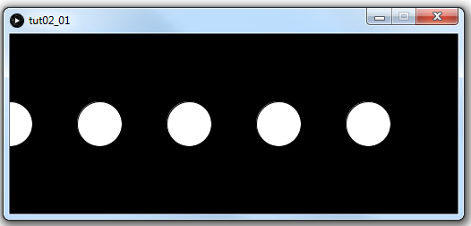

# Tutorial #2 - Arrays & Arraylists

## Part 0 - Classes & Objects

1.	Run the program [tut02_00](https://github.com/barcaxi/oop/blob/master/code/tutorials/tut02_00/tut02_00.zip?raw=true).
	It shows how a simple class is declared, created and used.  

	Make sure you have both program files in the same folder.

	Take time to understand this code.

2.	Modify the code to use the ``Spot`` class constructor:

	``Spot(float x, float y)``

	to add a second ``Spot`` to any other (x,y) location within the window.


## Part 1 - Arrays

1.	Run the program [tut02_01](https://github.com/barcaxi/oop/blob/master/code/tutorials/tut02_01/tut02_01.zip?raw=true).

2.	Change or add some more values in the array, and run again.

3.	Modify the code in ``setup()`` to first find the largest number in the array and then draw all ellipses using this number.

	If the largest number is 50 this is the output you'd see:

	

	Hint: use a separate variable which maintains the value of the highest number encountered thus far (and then check each array element and compare against this value).

4.	Open the program [tut02_02](https://github.com/barcaxi/oop/blob/master/code/tutorials/tut02_02/tut02_02.zip?raw=true).
	
	In ``setup()`` add a value one at a time to the ``data`` array.  Then run to see a simple bar chart.


5.	Open the program [tut02_03](https://github.com/barcaxi/oop/blob/master/code/tutorials/tut02_03/tut02_03.zip?raw=true).

	It has an array of grades.
	
	In ``draw()`` provide the code to draw a circle (ellipse) for each grade.  Draw each circle at a random location and use the grade value to determine the diameter of the circle.

6.	Modify the code in ``tut02_03`` to draw a red circle for any grade less than 40.

7.	Lastly, comment the line below in ``setup()``:

	```java
	// noLoop();
	```

	and run again.  This stops the ``draw()`` method being executed repeatedly.


## Part 2 - ArrayLists

These programs are the same as Part 1 but this time use an ``ArrayList`` for storage.


1.	Run the program [tut02_04](https://github.com/barcaxi/oop/blob/master/code/tutorials/tut02_04/tut02_04.zip?raw=true).

2.	Change some values and add another value in the arraylist, and run again.

3.	Modify the code in ``setup()`` to first find the largest number in the arraylist and then draw all ellipses using this number.

4.	Open the program [tut02_05](https://github.com/barcaxi/oop/blob/master/code/tutorials/tut02_05/tut02_05.zip?raw=true).
	
	In ``setup()`` create and add 5 values to the ``data`` arraylist.  Then run to see a simple bar chart.


5.	Open the program [tut02_06](https://github.com/barcaxi/oop/blob/master/code/tutorials/tut02_06/tut02_06.zip?raw=true).

	It has an array of grades.
	
	In ``setup()`` provide the code to create the arraylist called ``data`` and then iterate through ``grades`` array and add values to ``data`` arraylist.  

	In ``draw()`` provide the code to draw a circle (ellipse) for each grade using values from ``data``. 


## Part 3 - ArrayList of Spot objects

1.	Run the program [tut02_07](https://github.com/barcaxi/oop/blob/master/code/tutorials/tut02_07/tut02_07.zip?raw=true).
	Make sure that you understand what the code is doing.

2.	Run the program [tut02_08](https://github.com/barcaxi/oop/blob/master/code/tutorials/tut02_08/tut02_08.zip?raw=true).
	Make sure that you understand what the code is doing.

3.	Modify the program ``tut02_08`` so a fourth *spot* is created at an appropriate position behind the third spot.

4.	Modify the code so an enhanced for loop is used in the ``draw()`` method that replaces the standard for loop used to move and display the spots.

5.	Modify the code so a new *spot* is created each time a keyboard key is pressed.
	The (x,y) coordinate for it should be at (0,100).

6.	Modify the code so a new *spot* is created each time the mouse is pressed. 
	The (x,y) coordinate for it should be the current mouse (x,y) coordinate.


## Part 4 - ArrayList of Bubble objects

1.	Create a new program called ``tut02_09`` that uses the class ``Bubble`` below:

	```java
	public class Bubble
	{
	  float x;
	  float y;
	  float diameter;

	  public Bubble()
	  {
	    x=random(width);      // random position along x axis
	    y=height;             // start at bottom of window
	    diameter=random(50);  // random diameter
	  }

	  public float getX()
	  {
	    return x;
	  }
	  
	  public float getY()
	  {
	    return y;
	  }

	  public float getDiameter()
	  {
	    return diameter;
	  }

	  public void display()
	  {
	    fill(125, 50);
	    ellipse(x, y, diameter, diameter);
	  }

	  public void move()
	  {
	    y--;
	    x=x+random(-1, 1);
	  }

	  public String toString()
	  {
	    return "Bubble";
	  }
	}
	```

	Examine this class carefully before using it next.

2.	In the main program code:

	-	declare an arraylist called ``bubbles``
	-	in ``setup()`` create an arraylist called ``bubbles``
	-	in ``setup()`` add 3 bubble objects to the arraylist
	-	in ``draw()`` use a background colour ``RGB(185,223,234)``
	-	in ``draw()`` move and display all the bubbles

	When run you should see bubbles floating up the window like this:

	

3.	Now, use another loop at the end of the ``setup()`` method to figure out the largest bubble diameter in the list. Once you have determined the diameter of the largest bubble, you should print it.  For example:

	``largest diameter = 47.99947``	


## Part 4 - toString()

1.	Modify the program ``tut02_07`` so the method below is added after the ``draw()`` method:

	```java
	void mousePressed()
	{
	  println(sp);
	}
	```

	Run the program and press the mouse a few times.  Make sure that you understand what the code is doing and understand the output in the console window.

2.	Modify the ``Spot`` class code in ``tut02_07`` by uncommenting the ``toString()`` method.  Run the program again and click the mouse again.

3.	Modify the ``toString()`` method to print this data format each time the mouse is clicked:

	``
	[Spot: x=170.0, y=100.0, diameter=50.0]
	``


## Part 5 - Chroma key

Goto next part.


## Part 6 - Cards Array & ArrayList

This code will generate 5 random card numbers, store them in an array and display them.
Make sure you have the subfolder ``images`` in the same folder as your program.

1.	Open the program [tut02_11](https://github.com/barcaxi/oop/blob/master/code/tutorials/tut02_11/tut02_11.zip?raw=true).
	Make sure you also copy the ``images`` folder into this program folder.  Run the program.
	You should see 5 random cards printed in the window.

	Take time to read and understand the code.


2.	Change the value of the constant variable ``MAX_CARD_VALUE`` to 10 and run the program a few times to confirm duplicate cards can be dealt.

3.	Try to prevent the code from displaying duplicate cards.


Below is a more object-oriented way to tackle the idea of handling cards. 
We have a class ``Cards`` to store and handle the cards, and we can then create an object of that class wherever we wish.

4.	Open the program [tut02_12](https://github.com/barcaxi/oop/blob/master/code/tutorials/tut02_12/tut02_12.zip?raw=true).
	Again, make sure you also copy the ``images`` folder into this program folder.  Run the program.
	You should see 5 random cards printed in the window.

	Take time to read and understand the code.


5.	Modify the code to use an ``ArrayList`` not an array to store the cards. 

6.	Again, try to prevent the code from displaying duplicate cards.


## Part 7 - Additional ArrayList Exercises

Only do this part **after** you have completed [Tutorial 3](https://github.com/barcaxi/oop/blob/master/tutorials/Tutorial3.md).

1.	Open and run the program ``tut02_08`` again.
	A new spot should appear where the mouse is pressed and move across the window.

	Modify the code so spots are removed from the arraylist when they disappear off the right-hand side of the window.  You should notice the console output showing the correct number of spots in the arraylist.

2.	Open and run the program ``tut02_09`` again.
	3 bubbles should float up the window.

	Modify the code so that when the bubbles reach the top of the window they stay there.  It's as if the top of the window is like a line they cannot cross.  Make sure you can see the entire bubble, not half of it.

3.	Increase the window size to 600x600.

4.	Instead of creating 3 bubbles, try to create a random number of bubbles from a minimum of 1 to a maximum of 20.

5.	At the end of the ``draw()`` method add code to print the size of the bubbles arraylist.

6.	Modify the code so if the mouse is pressed inside a bubble that bubble should disappear.  Remove the bubble from the arraylist.  Try to *burst* all the bubbles before they reach the top of the window.  Checkout the method [dist()](https://processing.org/reference/dist_.html).

7.	If there are no bubbles left exit the program.

8.	Open and run the program ``tut02_11`` again.

9.	If a card is clicked with the mouse change the card to another card.

	Make sure it isn't a duplicate.

	Note:  you should comment out the statement below in the ``setup()`` method:

	```java
	// noLoop();

	```
