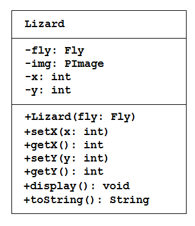

# Tutorial #4 - Composition

## Part 1 - Book "has-a" Author

1.	Run the program [tut04_01](https://github.com/barcaxi/oop/blob/master/code/tutorials/tut04_01/tut04_01.zip?raw=true) and observe it's output.
	
	Make sure you include the ``images`` folder in your project folder.

	Pay particular attention to the ``Book`` class and how it implements the "has-a" relationship with the ``Author`` class.

	> A Book has-a Author

	This is known as **composition** in Java.

2.	Open the program [tut04_02](https://github.com/barcaxi/oop/blob/master/code/tutorials/tut04_02/tut04_02.zip?raw=true).

3.	Examine the code in the ``setup()`` method.  Then modify the code in the ``Book`` class so that it supports an array of ``Author`` objects.  You only need to modify the code in ``Book`` class.

	When the ``Book`` class is modified correctly the code should show a book with 2 authors.
	

## Part 2 - Zack the Lizard

Zack is a lizard.  Flies annoy him.

This program illustrate composition again:

> A ``Lizard`` has-a ``Fly``

Read on...

Open the program [tut04_03](https://github.com/barcaxi/oop/blob/master/code/tutorials/tut04_03/tut04_03.zip?raw=true) and write the missing code for the ``Lizard`` class. 



The ``Lizard`` class has:

-	four private instance variables: ``fly``, ``img``, ``x``, and ``y``.  ``fly`` is an instance of the ``Fly`` class which you are given.

-	a constructor:

	```java
		public Lizard(Fly fly) {...}

	```

	Initialise the class variable ``fly`` with the constructor argument ``fly``.  Also, initialise the ``x`` and ``y`` values to ``0`` (zero).

-	public methods ``setX()``, ``getX()``, ``setY()``, ``getY()``, and ``display()`` which you are given.

-	``toString()`` which should return "[Lizard: x=*x*;y=*y*]" e.g. "[Lizard: x=100;y=200]"


1.	Complete the missing code in ``Lizard`` class.  If completed correctly the project should run.  A fly should annoy the lizard.

	


2.	Next, modify the code in the ``Lizard`` class so that it supports an array of 10 ``Fly`` objects.  You will not need to modify any code in the ``Fly`` class.

	Use this new ``display()`` method in the ``Lizard`` class:

	```java
	public void display()
	{
		img = loadImage(imageFile);
		setX(mouseX);
		setY(mouseY);
		image(img, getX(), getY());    

		for (int i=0; i<flies.length; i++) // flies array
		{
			flies[i].move();
			flies[i].display();
		}
	}

	```

	and use this code to test your modified ``Lizard`` class:

	```java
	Lizard lizard;
	Fly[] flies;

	void setup()
	{
		size(800, 800);
		noCursor();

		flies = new Fly[10];
		for(int i=0;i<flies.length;i++)
			flies[i]=new Fly();

		lizard = new Lizard(flies);
	}

	void draw()
	{
		background(0);  
		lizard.display();
		println(lizard);  
	}

	```

