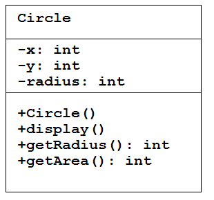
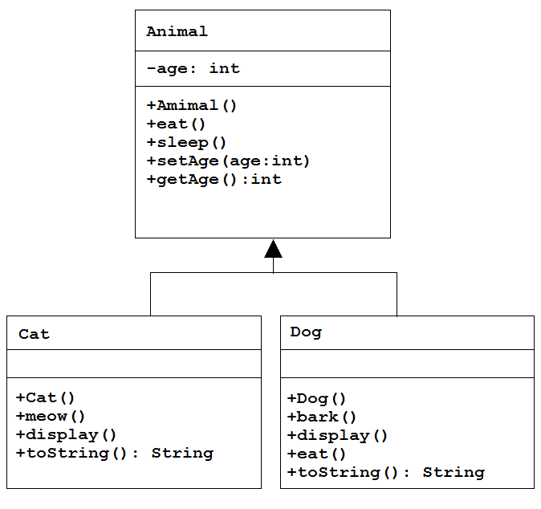
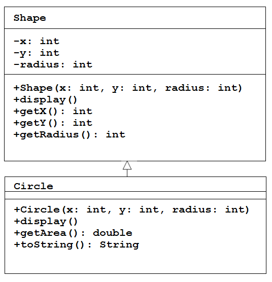
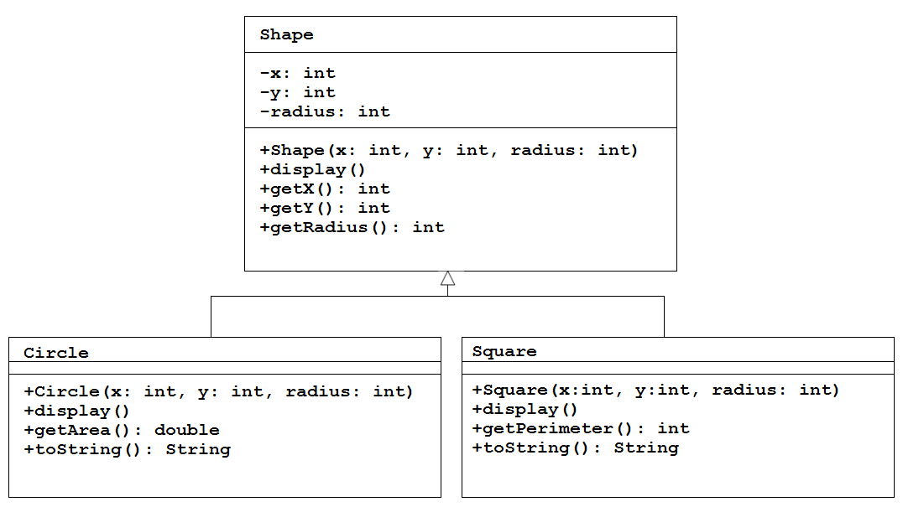
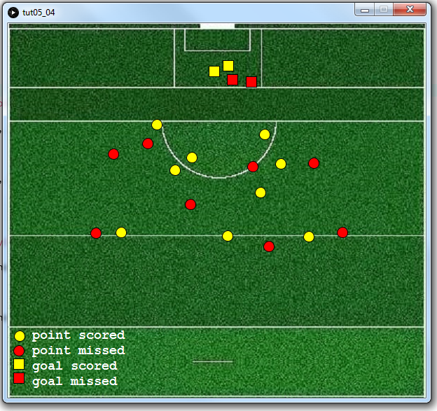
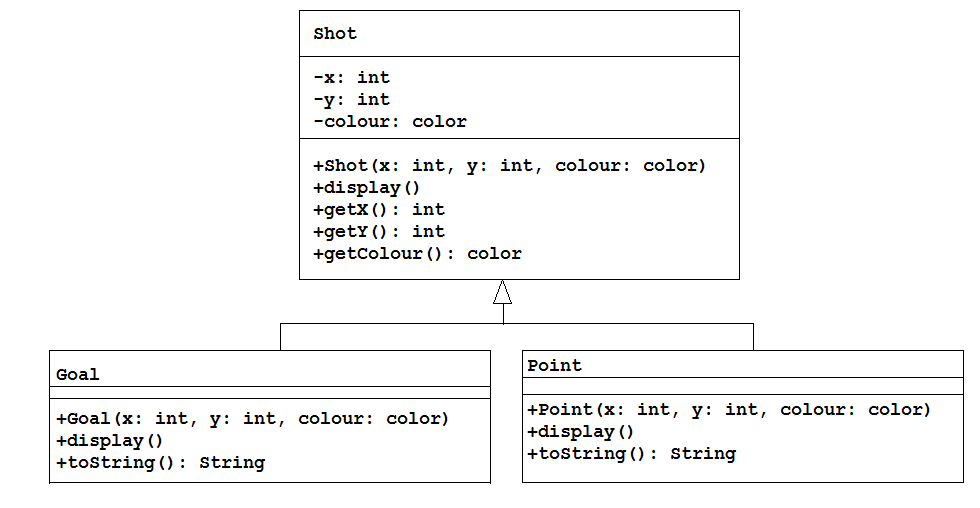

# Tutorial #5 - Inheritance


## Part 1 - Revision




A class called ``Circle`` is designed as shown above. It contains: 

-	three ``private`` instance variables - ``x``, ``y``, and ``radius``
-	one default constructor
-	three public methods: ``display()``, ``getRadius()`` and ``getArea()``


1.	Open and run the program [tut05_01](https://github.com/barcaxi/oop/blob/master/code/tutorials/tut05_01/tut05_01.zip?raw=true).  Make sure you understand how this is working.

2.	 Modify the class ``Circle`` to include a second constructor for constructing a ``Circle`` instance with arguments for ``x``, ``y`` and ``radius``:

	```java
	public Circle(int x, int y, int radius) 

	```
	Provide the necessary code to initialise the class variables with the constructor arguments.

3.	Modify the test program ``tut05_01`` to construct an instance of ``Circle`` using the new constructor.


4.	Add **getter** methods for both class variables ``x`` and ``y``, for example:

	```java
	public int getX() {...}

	```

5.	Accessing private class variables.  SKIP FOR NOW.


6.	Add three public **setter** methods for changing the ``x``, ``y``, and ``radius`` class variables in ``Circle``.
	
	In ``tut05_01`` test these methods with code like this:

	```java
	c = new Circle();
	c.setX(100);
	c.setY(100);
	c.setRadius(30);

	```


7.	In the second constructor:

	```java
	public Circle(int x, int y, int radius) 

	```

	use the keyword ``this`` when referring to the class variables. (if you're not doing so already)


8.	Every well-designed Java class should contain a method called ``toString()`` that returns a short ``String`` description of the object.  Include a ``toString()`` method in the ``Circle`` class:

	```java
	public String toString()
	{
		return ....;
	}

	```	

	It should return a string in the format:  "Circle: x=<xValue>; y=<yValue>; radius=<radiusValue>;".  For example, "Circle: x=0; y=0; radius=20;"


	In ``tut05_01`` test ``toString()`` works like this:

	```java
	Circle c = new Circle(100,100,50);
	println(c.toString());             // explicit call
	println(c);                        // implicit call

	```


## Part 2 - Inheritance Example



In this exercise a ``Cat`` and ``Dog`` class are implemented as subclasses of an ``Animal`` class as shown above.

1.	Open and run the program [tut05_02](https://github.com/barcaxi/oop/blob/master/code/tutorials/tut05_02/tut05_02.zip?raw=true).  

2.	Examine the output in the console windown and take time to trace each method called for the ``cat`` and ``dog`` objects.  Make sure you understand this code.

A subclass can be expanded to include additional functions and properties beyond what is contained in the superclass. For example, let’s assume that a ``Dog`` object has a hair color.

3.	Modify the ``Dog`` class to include a ``String`` variable ``hairColour``.  Assign a default hair colour of "black" in the default constructor.

4.	Also, write setter and getter methods for the ``hairColour`` variable.

5.	Modify the ``toString()`` method to print the dog object's hair colour.  Use the getter method.  Test the ``toString()`` method works correctly.


## Part 3 - Inheritance Shapes

In this part a ``Circle`` and ``Square`` class are implemented as subclasses of a ``Shape`` class.

1.	Open and run the program [tut05_03](https://github.com/barcaxi/oop/blob/master/code/tutorials/tut05_03/tut05_03.zip?raw=true).  Examine and understand the code.

2.	Let's have the ``Circle`` class inherit variables and methods from the ``Shape`` class.  Update the ``Circle`` class code so it extends from ``Shape``:

	```java
	public class Circle extends Shape

	```

	Initially, you'll have an error with the ``Circle`` constructor, we'll fix that next.

3.	Every constructor in a subclass should explicitly call a constructor in the superclass.
	Modify the code in the ``Circle`` constructor to do this.  It should look like this:

	```java
	public Circle(int x, int y, int radius)
	{
		super(x, y, radius);

		//this.x=x;
		//this.y=y;
		//this.radius=radius;
	}

	```

	We've done two things here:

	-	we now call our superclass constructor and pass it the values for ``x``, ``y``, and ``radius``.
	-	we no longer need to intialise the ``Circle`` variables ``x``, ``y``, and ``radius``. Indeed we don't need these variables in ``Circle`` at all, because we inherit them from ``Shape``.  This is known as *shadowing of instance fields*.  It should NEVER be allowed to happen. We will fix this next.

4.	Examine the class ``Circle`` and remove any shadow class variables.
	Again, you'll have some errors but we'll fix those next.

5.	Examine the class ``Circle`` and remove any shadow class methods too, i.e. any duplicate methods that are inherited from ``Shape`` already.  You should only remove three methods from ``Circle``.
	You'll have one error with with the ``radius`` variable, we'll fix that next.


6.	The variable ``radius`` is not visible in the ``Cirlcle`` method ``getArea()``.  That is because it is correctly declared as a ``private`` variable in ``Shape``.  To fix this use the publicly visible method ``getRadius()`` from ``Shape``, like this:

	```java
	public double getArea()  
	{
		return getRadius()*getRadius()*Math.PI;
	}

	```
 
7.	Run the sketch.  It should now work.  You will have successfully modified ``Circle`` to inherit from ``Shape``.  Double-check your two classes implement the following class diagram:

 	

8.	Modify the code in ``tut05_03`` to use a ``println()`` statement to print the area of the circle and print a string repesentation of the circle.


9.	Implement a new class called ``Square`` as shown in the class diagram.

	

	It inherits variables and methods from ``Shape``. Assume the length of the square is twice the ``radius``.  Provide the appropriate code for constructor, ``getPerimeter()``, ``display()`` and ``toString()`` methods.  

10.	Test the ``Square`` class with this tester code in ``tut05_03``:

	```java
	...
	Square s;

	void setup()
	{
		size(300, 300);

		...
		...

		s = new Square(100, 200, 30);
		println(s.getPerimeter());  // should print 240
		println(s);                 // should print "Square: length=30"	
	}

	void draw()
	{
		background(0, 0, 0);
		c.display();
		s.display();
	}
	```

## Part 4 - GAA Score Image

In this part we'll create a program that can record and create a simple GAA score image as shown:



1.	Open and run the program [tut05_04](https://github.com/barcaxi/oop/blob/master/code/tutorials/tut05_04/tut05_04.zip?raw=true).  Examine the code.

2.	The program implements a simple class hierarchy as shown in this class diagram:

	

	Examine this diagram when writing the code that follows.

3.	Add the ``getX()``, ``getY()`` and ``getColour()`` methods to the superclass ``Shot``.

4.	In ``Goal`` and ``Point`` inherit functionality from the ``Shot`` class.

5.	In ``Goal`` and ``Point`` provide the appropriate constructors and use the ``super`` keyword to invoke the superclass constructor that intialises the class variables.

6.	In ``Goal`` use the ``@Override`` annotation and override the ``display()`` method to include the following code:

	```java
    rectMode(CENTER);
    fill(getColour());
    rect(getX(), getY(), Shot.SIZE, Shot.SIZE);

	```

	Notice how we use the constant ``SIZE`` declared in the ``Shot`` class.


7.	In ``Point`` use the ``@Override`` annotation and override the ``display()`` method to include the following code:

	```java
    fill(getColour());
    ellipse(getX(), getY(), Shot.SIZE, Shot.SIZE);

	```

8.	Add a ``toString()`` method to ``Goal`` so that it will return the following type of text if a goal shot is scored - "Goal:@(354,117) scored" OR this if a goal shot was missed "Goal:@(154,127) missed".

9.	Add a similar ``toString()`` for the ``Point`` class.  

10.	Run your program to test all is working.  If you press the letter "s" an image called ``scoreChart.png`` will be created from what is visible in your window.  Try it out and find it in your sketch folder.


